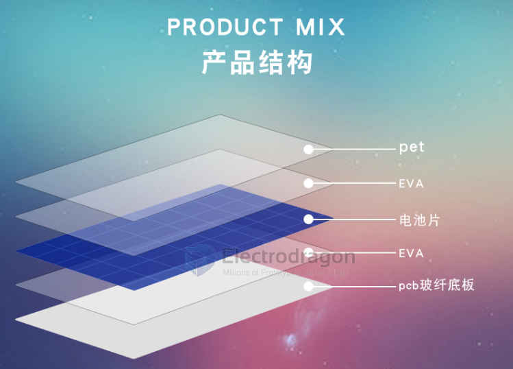
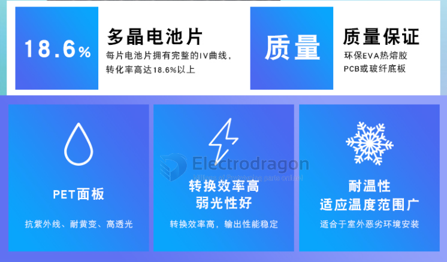
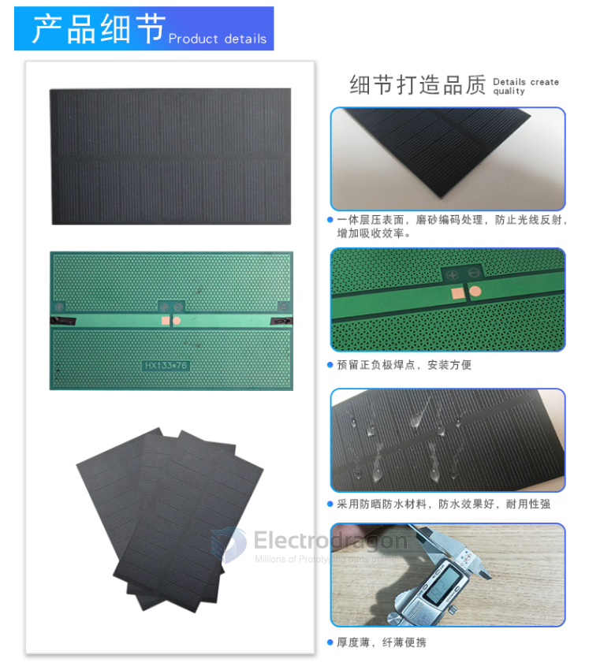
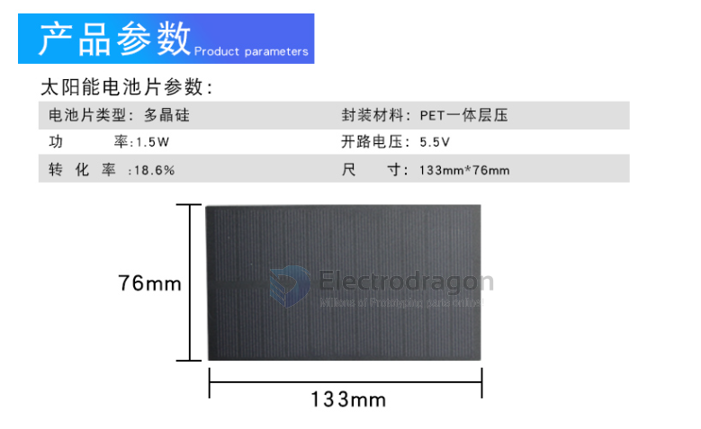

# OPS1009-DAT 

[PET Laminated Integrated Solar Panel Unit R3](https://www.electrodragon.com/product/solar-panel-unit/)

### R3 - polycrystalline silicon solar panel

135 x 76 mm / Output 5V / 300mA / 1.5W

### R2 - PET laminated Board

- 5V 220mA, 1.1W, 110*80*2 mm
- This technique that has less stiffness but can work on bigger size.
- This is a unit of solar panel, serial connection can increase the volt and parallel connection can increase the current. So for example type 2, you can parallel connect 4-5 pcs to easily charge your cell phone; if you want to charge on 12V storage battery, two unit should be serial connected. 

### R1 - Epoxy covered Board

- 6V 200mA, 1.2W, 160*140 mm
- Great stiffness, good for outdoor environment
- This technique only support on small size and a little bit thicker. Compressive strength, corrosion resistance, appearance beautiful crystal clear, anti-UV, anti-yellowing, high transmittance EPOXY.

## ref 

- [[OPS1009]]
  
- [[solar-panel-dat]]

- [[solar-panel]]