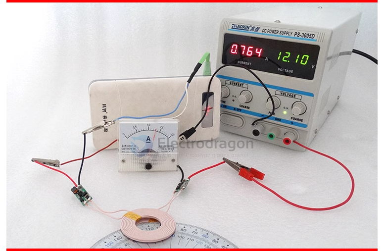

# OPS1013-dat

## Usage Images 

## SCH 

## Notes 

- Do not reverse the positive and negative input power of the **transmission module**.
- Do not short-circuit the positive and negative load lines of the **receiving module's output**.
- **The module with magnetic pieces** allows metal to be close to the back of the magnetic piece.
- The working surface of the two coils can only penetrate **non-metallic materials** for wireless power transmission.

## Demo 

- blog post - https://www.electrodragon.com/wireless-charging-test/

## ref 

- [[OPS1013]]