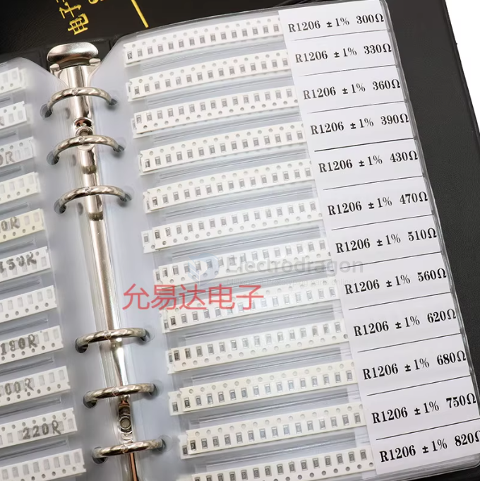
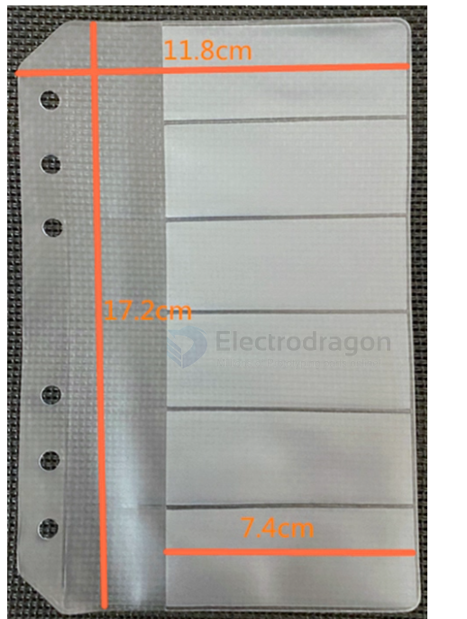

# PENS014-dat

## Info

[product url - SMD Collecting booklet / Sample Book](https://www.electrodragon.com/product/smd-collecting-booklet-sample-book/)

### Board Map, Dimension, Pins, chip info, Use Guide, Setup Jumper, etc.

SMD Capacitor and Resistor Component Book, Sample Book, Empty Electronic Component Book

Size specifications: Cover: Length 19 cm x Width 13.5 cm, cover without company name, neutral packaging 

Inner pages: Length 17.2 cm x Width 11.8 cm (covered area 7.4 cm) 

Specification 1: Divided into 6 rows on average, each row about 28mm high, especially suitable for slightly wider SMD tape components

the current selling version is **12-row per page**

### small size version == 12-row per page 

Every page is diverted into 12 lines, every line is about 14.75 height

### large size version == 6-row per page 

Note: 6 columns bigger inner page (refer to standard version’s last page) booklet is the same price, if you need only bigger inner page version, please just add order note.

Every line is 29.5 height.

## Applications, category, tags, etc. 

## Demo Code and Video

## ref 

- [[PENS014]] 

- [[parts-stock-dat]]
