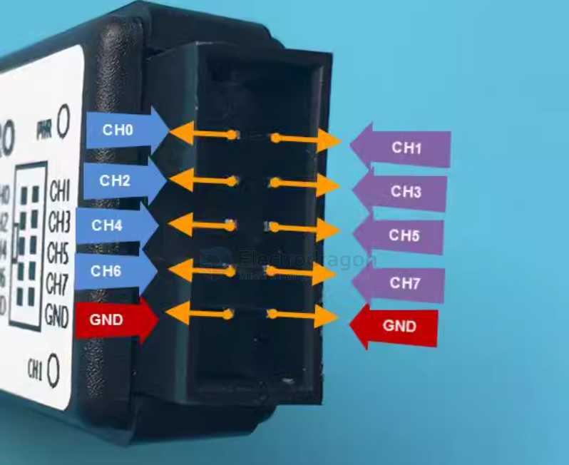
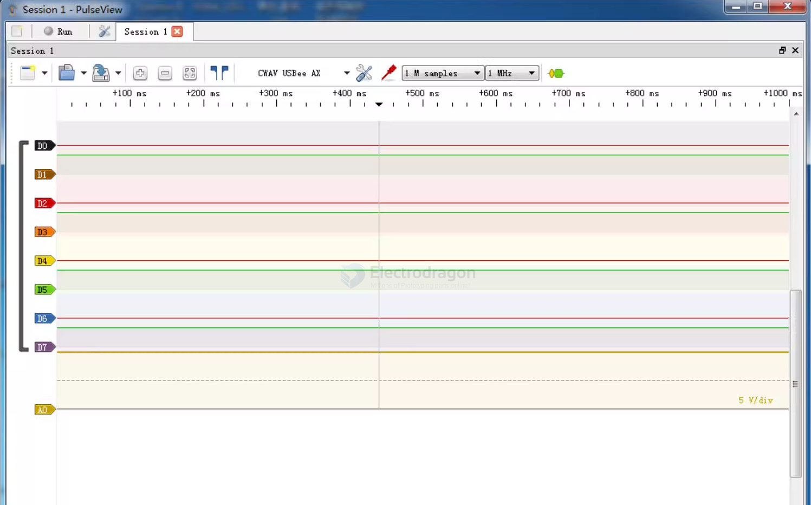

# pins003-dat

## Pins map 

## Software PulseView 

## Note 

- detection TTL on low
- pull-up resistors should not be too strong in case it can not be pull to low 
- low TTL has to be 0.7V below to detect 

## ref 

- demo video - http://www.saleae.com/logic/videos
- download software - http://www.saleae.com/downloads
- Please find in our bitbucket folder -> git clone https://github.com/Edragon/logic-analyzer.git

- [[pins003]]

