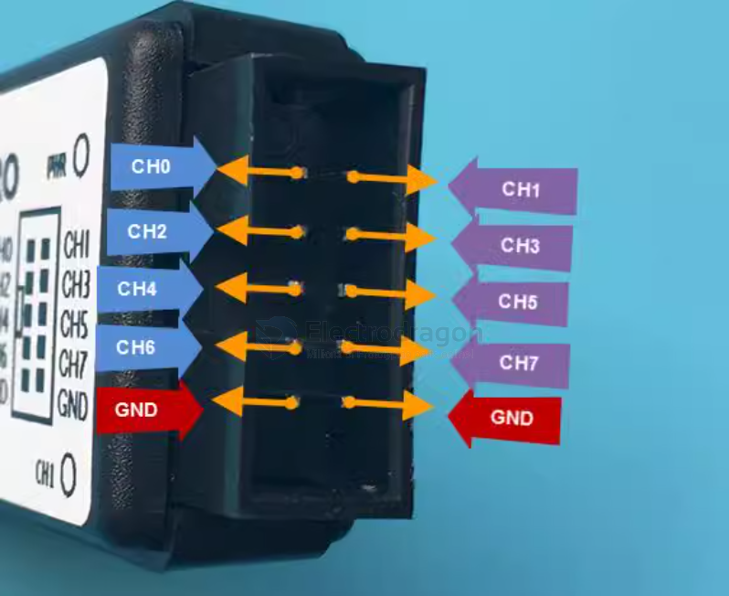
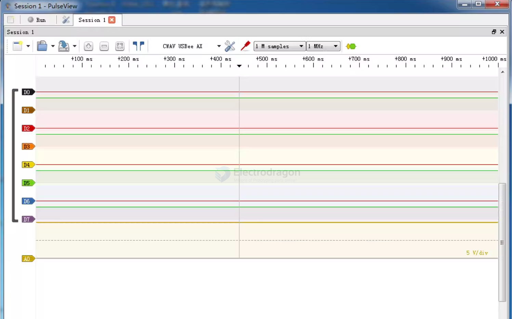
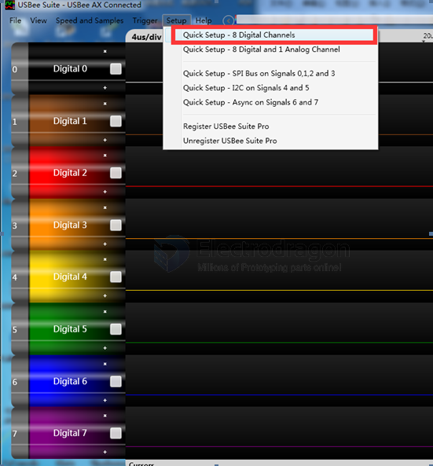
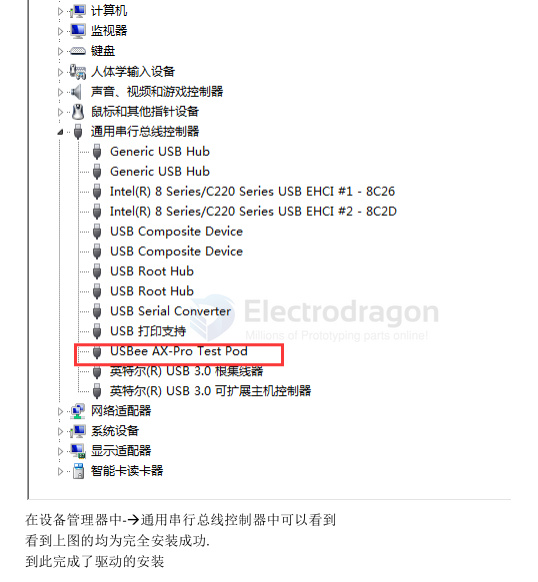
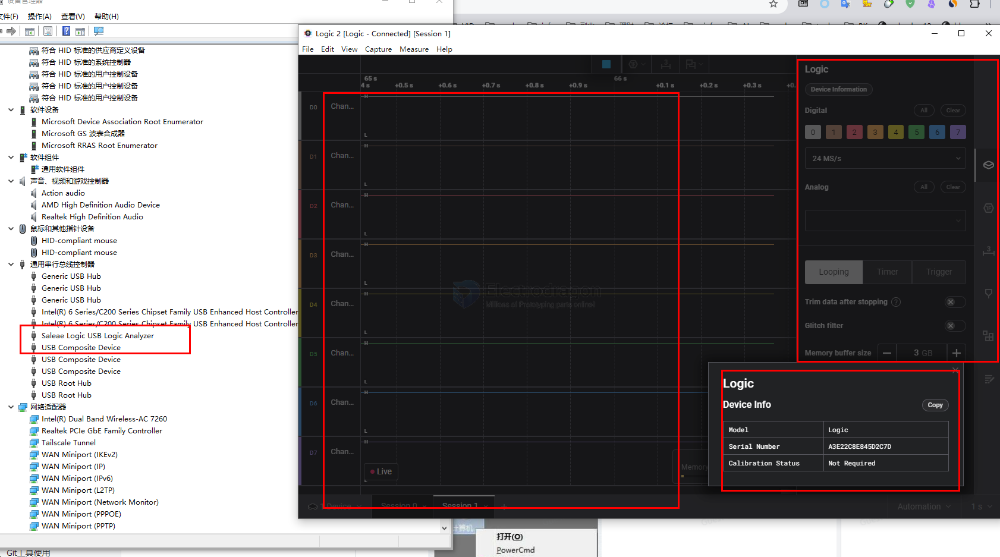
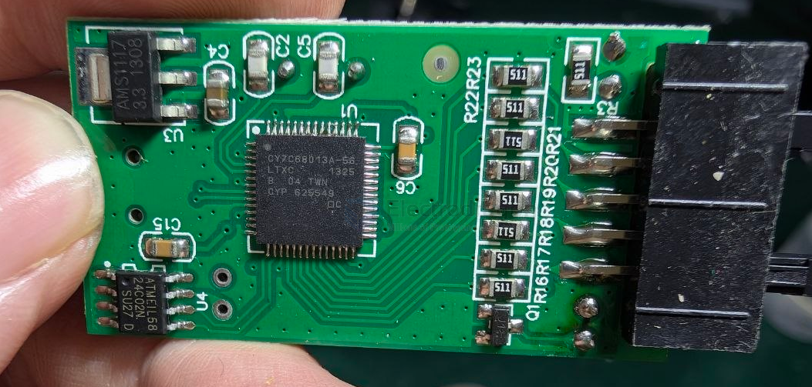
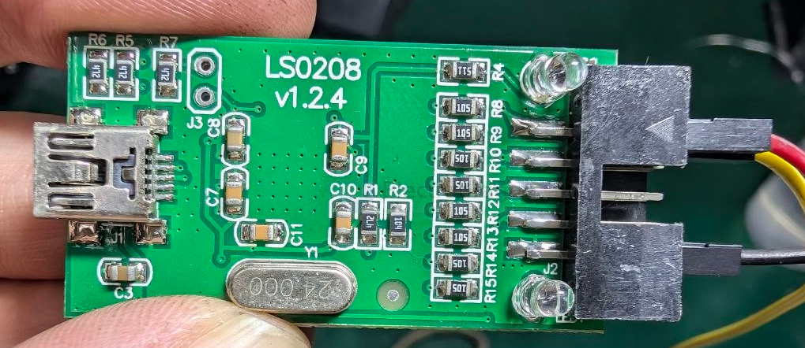

# pins003-dat

- [[logic-analyzer-dat]] - [[signal-digital-dat]] - [[signal-analog-dat]] - [[digital-dat]] - [[signal-dat]]

[Saleae8 USB Logic Analyzer 24M 8-Channel](https://www.electrodragon.com/product/saleae-usb-logic-analyzer-24m-8-channel/)

## specs 

8路数字通道性能:
- 最大采样速度: 24Msps
- 输入电压范围: 0~5V
- 数字通道:   8
- 输入低电平:  <0.8V
- 输入高电平:  >1.4V
- 支持协议:  SPI,IIC,UART,SMBus,I2S,CAN,Parallel,Custom,Search,Async,1-Wite,PS/2

## Pins map 

## Software PulseView 

## Note 

- detection TTL on low
- pull-up resistors should not be too strong in case it can not be pull to low 
- low TTL has to be 0.7V below to detect 

## guide 

这是一款8路逻辑分析仪，仅有逻辑分析功能，无示波器功能（示波器需要AD模块，这个模块远超30元）

软件使用时，请直接切换成8路逻辑功能

## driver 

## saleae logic 2

## software 

Driver
[Saleae: Driver Install | Saleae Support](https://support.saleae.com/logic-software/driver-install)

[USBee: 链接：axsw64.zip](https://pan.baidu.com/share/init?surl=jZvdUh1FnFxMTOsb_TSxdQ&pwd=zhvo)

特殊情况，根据 [Windows driver - sigrok](https://sigrok.org/wiki/Windows#Drivers) 可使用: [Zadig - USB driver installation made easy (akeo.ie) 进行安装。](https://zadig.akeo.ie/)

Software
[USBee: CWave USBee Software Downloads (interworldna.com)](https://www.interworldna.com/cwave/cw_downloads.php)

[Saleae: Logic 2](https://www.saleae.com/pages/downloads)

[sigrok: PulseView](https://sigrok.org/wiki/Downloads)

## demo 

- [setup guide ](https://www.youtube.com/shorts/aOFLWS1JEIU)

- [[pins003]]

- [[win-framework-dat]] - [[SDK-dat]]

## build

- [[cypress-dat]] - [[Infineon-dat]] - [[pins003-dat]]

## pulseview 

win10x64 
https://sigrok.org/download/binary/pulseview/pulseview-NIGHTLY-x86_64-release-installer.exe

## clone 

Clone
下面是被仿制的原产品，连接 USB 后，通过设备管理器可以查看它的 VID 和 PID，得出它的固件用的是什么产品的。

USB VID&PID	Vendor	Product manufacturer	Origin device
0925 3881	Lakeview Research	Saleae	Saleae Logic
08A9 0014	CWAV	USBee	USBee AX-Pro

## ref 

- demo video - http://www.saleae.com/logic/videos
- download software - http://www.saleae.com/downloads
- opensource pulseview - https://www.sigrok.org/wiki/Downloads
- pulseview guide - https://sigrok.org/wiki/Windows#Drivers
- Please find in our bitbucket folder -> git clone https://github.com/Edragon/logic-analyzer.git

