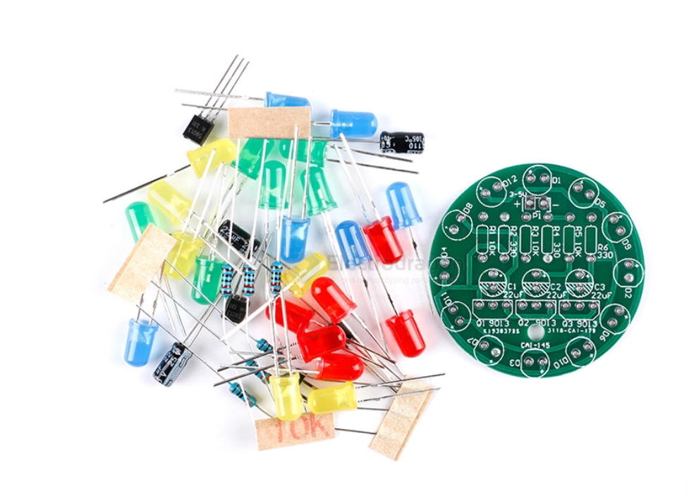
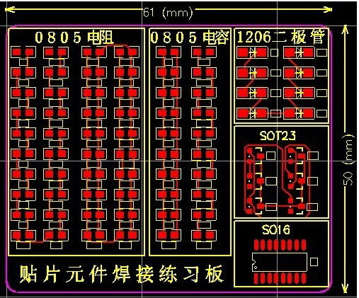

# PPB0021-dat

## PTH version V3 

price is 0.8 usd, please order below 1pcs for 2 pcs of this PTH V3 board 

and add order note "order for PPB0021 V3"

https://www.electrodragon.com/product/smd-soldering-skills-training-board/

## V2 - red board (current selling version)

R2 red board details:

Maybe you are already a master of programmer, but how about the tiny SMD soldering, it's might be pretty hard for many people. Now we got this kit for you to practice your SMD soldering skills.This kits includes:

- PCB board size 48*60MM
- SMD conponents 102pcs, varies from 0402, 0603, 0805, 1206
- Includes ICs CD4017,  NE555, etc. All common parts.
- One side for loop LEDs, has schematic. Power supply 3.3-12V.
- One side for exercise, has testing points.

## V1 - green board (add order note to order this version)

## Shipping list:

- 1 PCB blank
- 10 1206 package resistors
- 40 0805 package resistors
- 10 0603 package resistors
- 8 1206 package diodes
- 8 SOT23 package transistors
- 1 SO16 package IC

## ref 

- [[fab-dat]]

