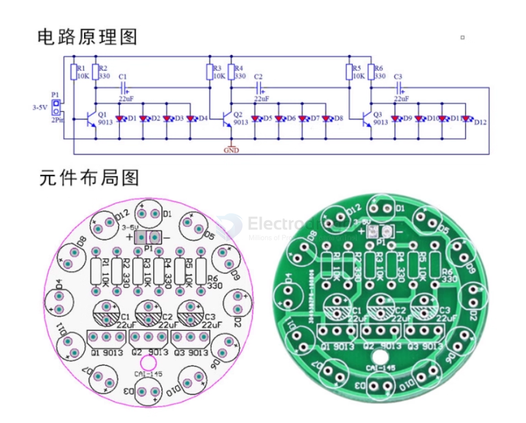
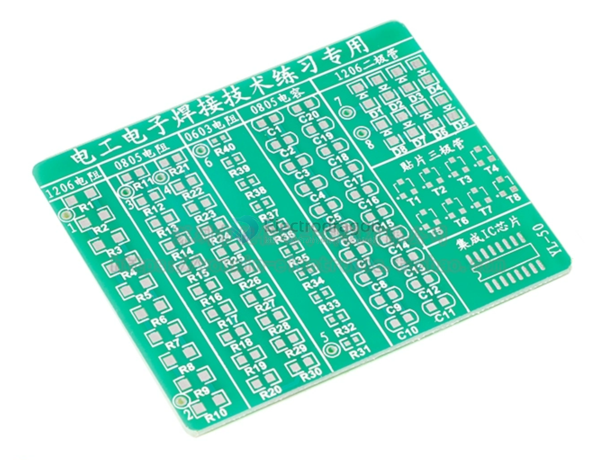

# PPB0021-dat

[board link](https://www.electrodragon.com/product/smd-soldering-skills-training-board/)

## PTH version V3 

price is 0.8 usd, please order below 1pcs for 2 pcs of this PTH V3 board 

and add order note "order for PPB0021 V3"

## V2 - red board (current selling version)

R2 red board details:

Maybe you are already a master of programmer, but how about the tiny SMD soldering, it's might be pretty hard for many people. Now we got this kit for you to practice your SMD soldering skills.This kits includes:

- PCB board size 48*60MM
- SMD conponents 102pcs, varies from 0402, 0603, 0805, 1206
- Includes ICs CD4017,  NE555, etc. All common parts.
- One side for loop LEDs, has schematic. Power supply 3.3-12V.
- One side for exercise, has testing points.

Full set of loose parts with circuit board: PCB circuit board plus all components (including 102 component soldering practice board)

Note: This item is sold in loose parts form, requires manual assembly and debugging (shipment includes board and components)

Courseware and soldering video gift

Provides more professional SMD soldering technology teaching courseware and soldering video

(Hand-in-hand teaching you soldering, note that the pictures in the courseware are similar, mainly to learn the soldering skills in the materials)

2015 new model entry-level second-generation SMD soldering practice board! Dedicated for electronic product assembly skills competition!

In order to improve the soldering skills of electronic professional students and electronic enthusiasts, referring to the SMD component package types in the 2011 National Vocational College Electronic Product Assembly and Debugging Skills Competition, this SMD soldering practice board was specially designed to improve welding level and speed.

- **Board Size**: 48x60 MM
- **Board Thickness**: 1.6 mm
- **Board Material**: International standard board, all pads are tinned, fireproof and drop-proof material, can be disassembled and assembled repeatedly.
- **Net Weight**: 15g
- **PCB Design**: Reasonable design, no burrs, size 48x60 MM, can be put in pocket.
- **Components**: All commonly used SMD components.
- **Practice Areas**: Left and right 3 columns of components for practicing soldering, each column has test points.
- **Circuit**: Middle circular circuit is a running light circuit, composed of CD4017, NE555, LED, after correct soldering, power on to work.

## V1 - green board (add order note to order this version)

## Shipping list:

- 1 PCB blank
- 10 1206 package resistors
- 40 0805 package resistors
- 10 0603 package resistors
- 8 1206 package diodes
- 8 SOT23 package transistors
- 1 SO16 package IC

## ref 

- [[training-board-dat]] - [[app-dat]]

- [[fab-dat]]

