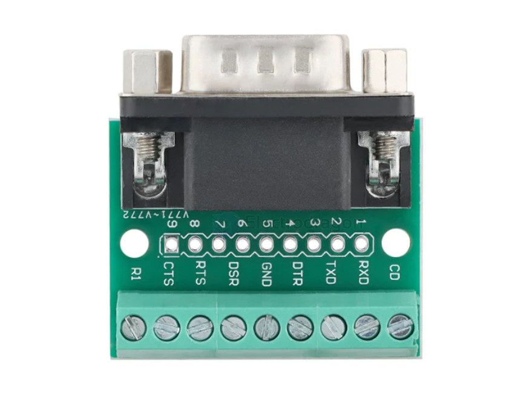
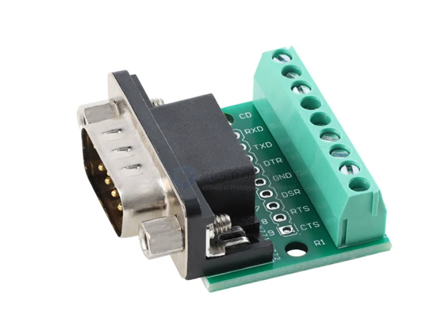

# PPB1071-dat

- [[RS232-dat]]

## Info

[product url - DB9 to Screw Terminal Convert Prototype Board](https://www.electrodragon.com/product/db9-screw-terminal-convert-prototype-board/)

### Board Map, Dimension, Pins, chip info, Use Guide, Setup Jumper, etc.

## Applications, category, tags, etc. 

## Demo Code and Video

## ref 

- [[PPB1071]] 

- legacy wiki page 

