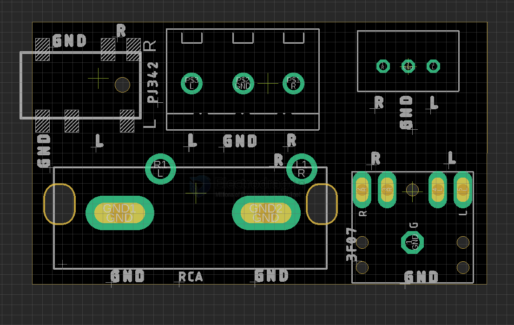

# PPB1077-dat

## tech 

- [[audio-dat]] - [[amplifier-dat]]

- [[PPB1077-dat]] - [[audio-output-dat]] - [[audio-dat]]

- [[signal-differential-dat]] - [[signal-dat]]

## Board Map 

- basic pins GND / L / R 

- [[PJ342-dat]] - [[3F07-dat]]

- [[RCA-dat]]

- [[XH2.54-dat]] - [[CONN-cable-terminal-dat]]

## ref 

- [[CONN-audio-dat]]

- [[KF128-dat]] - [[XH2.54-dat]]