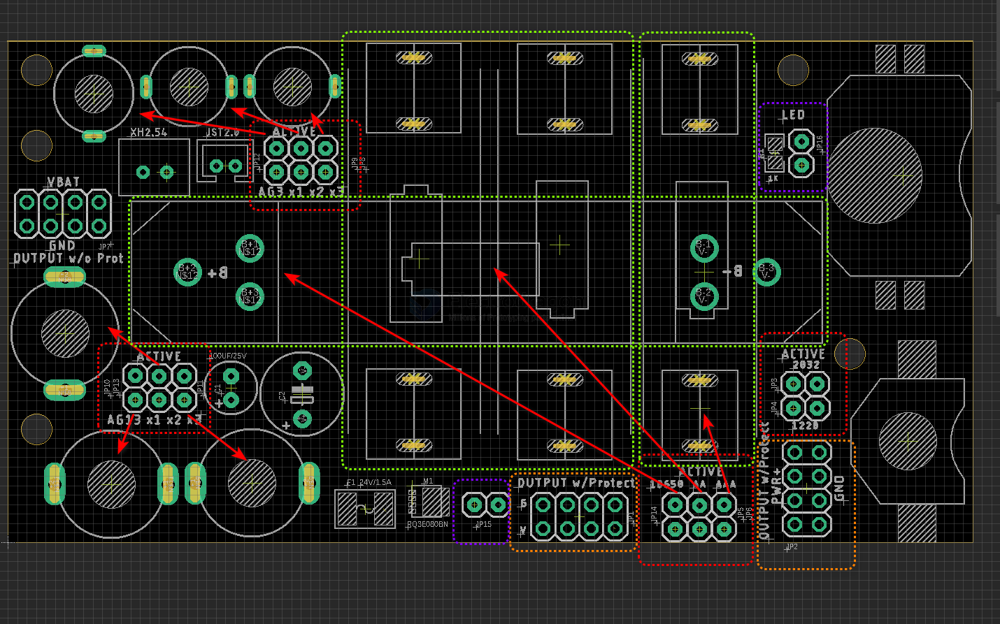

# PPB1080-dat

## Board map 

- green box
  - 18650 battery on the backside of the baord
  - 2x AA 
  - 1x AAA

- purple box 
  - serial connector jumper for 2x AA (will to change to 3-way jumper later)
  - LED plug-in port (serial connected 1K resistor)

- red boxes and red arrows = active battery selector 
  - AG3 x1 x2 x3
  - AG13 x1 x2 x3 
  - 18650 battery, 2x AA, 1x AAA
  - CR2032, CR1220

- extra plugger, left -, right +
  - XH2.54 port 
  - XH2.00 port 

## note 

- all the series battery should be same brand, same brand new batch
- PRESS slighly hard in case the battery holder didn't hold the batteries well
- all the jumper can be used to insert voltage monitor 
- insert only ONE battery group once

## test 

- AG3  = LR41H, battery drop from 2.9V to 1.6V when run the led

## demo 

## version 

## ref 

- [[18650-dat]] - [[battery-dat]]

- [[PPB1080]]