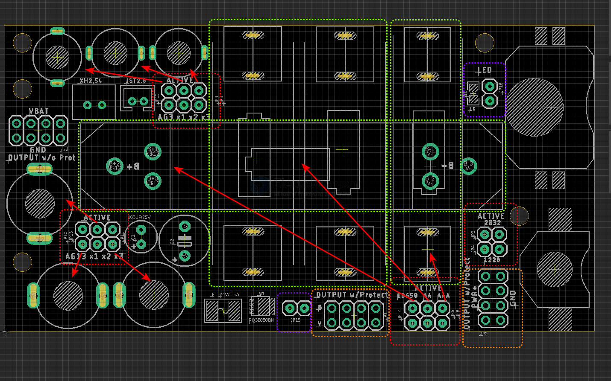
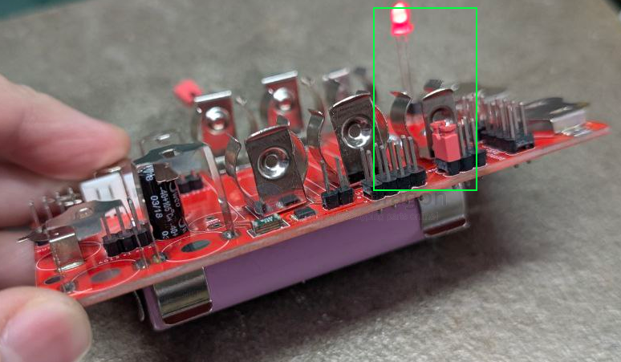
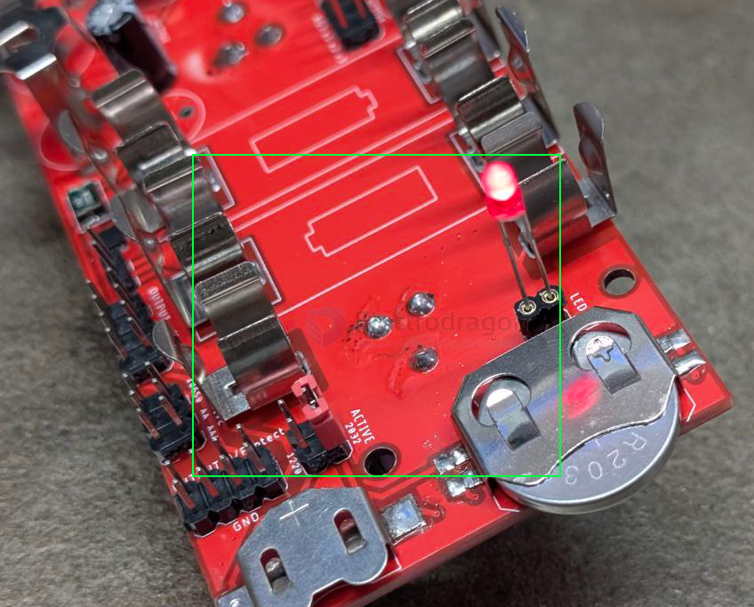
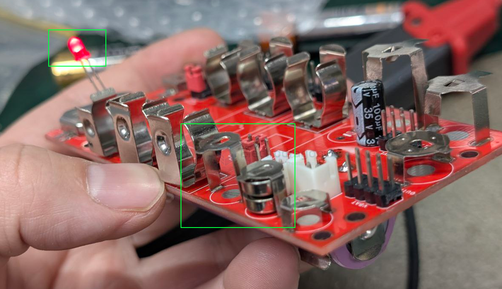

# PPB1080-dat

- [[battery-dat]] - [[battery-holder-dat]]

- [[CR2032-holder-dat]] - [[AA-battery-holder-dat]] - [[18650-battery-holder-dat]]

- [[AG3-dat]] - [[AA-battery-dat]] - [[AAA-battery-dat]]

- [[CR2032-dat]] - [[CR1220-dat]]

- [[AG13-dat]]

## Board map 

- green box
  - 18650 battery on the backside of the baord - [[18650-battery-holder-dat]]
  - 2x AA  - [[AA-battery-holder-dat]] - [[battery-AA-dat]]
  - 1x AAA - [[AA-battery-holder-dat]]

- purple box 
  - serial connector jumper for 2x AA (will to change to 3-way jumper later)
  - LED plug-in port (serial connected 1K resistor)

- red boxes and red arrows = active battery selector 
  - AG3 x1 x2 x3 - [[AG3-dat]]
  - AG13 x1 x2 x3 
  - 18650 battery, 2x AA, 1x AAA
  - CR2032, CR1220

- extra plugger, left -, right +
  - XH2.54 port 
  - XH2.00 port 

## board features 

- on board reverse protection for battery reverse connection protection
- on board test LED 
- [[sensor-voltage-dat]] insertable for battery voltage monitoring

## note 

- **enable each battery's jumper to use it!**
- **be aware the metal contact should well contact and avoid wrong contact !**

- all the series battery should be same brand, same brand new batch
- PRESS slighly hard in case the battery holder didn't hold the batteries well
- all the jumper can be used to insert voltage monitor 

## demo 

18650 battery enable 

[[CR2032-dat]] - battery enable 

[[AG3-dat]] - battery enable == 2x 1.5V

## version 

version 2 - fix AA battery length 

## ref 

- [[18650-dat]] - [[battery-dat]]

- [[PPB1080]]