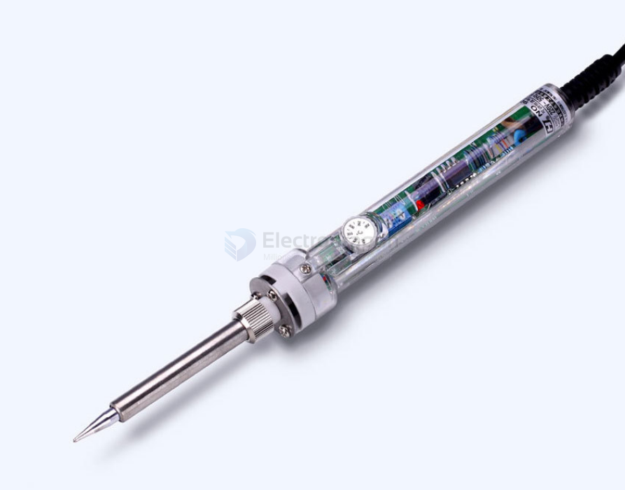

# PTOS009-dat

- [[soldering-iron-dat]]

## Info 
 
[product url](https://www.electrodragon.com/product/220v60w-internally-heated-soldering-iron-adjustable-temperature-220-450c/)

[official web info 2](https://www.hhgj.cn/)

[official web info](http://www.hhgj.com.cn/products_detail/&productId=955152e5-de39-47da-96f7-eafe1444330c.html)

An adjustable constant temperature soldering iron is a soldering iron that can adjust the temperature as needed. It has a constant temperature function and can perform precise welding and soldering operations at different temperatures. This type of soldering iron is usually composed of components such as a soldering iron tip, a heating element, a temperature controller, and a plug.

The advantages of an adjustable constant temperature soldering iron are mainly reflected in the following aspects:

First, the appropriate temperature can be selected according to different welding requirements and materials. By adjusting the temperature controller, the temperature of the soldering iron can be adjusted to a temperature range suitable for welding to ensure welding quality and efficiency.

Second, the constant temperature function can stably maintain the working temperature of the soldering iron. Even under long-term use or temperature fluctuations, the constant temperature soldering iron can maintain a stable working temperature and improve the stability and reliability of welding.

In addition, the adjustable constant temperature soldering iron usually has the functions of rapid heating and constant temperature heat recovery. When in use, it only takes a short wait to reach the set temperature, and then quickly perform the welding operation; after stopping use, the constant temperature function can quickly heat back, reduce waiting time, and improve work efficiency.

In addition, adjustable constant temperature soldering irons usually have safety protection functions, such as overload protection, overheating protection, etc., which can effectively protect the safety of users and equipment.

In general, adjustable constant temperature soldering irons are powerful, easy to operate, safe and reliable welding tools, suitable for various welding occasions and requirements, and are one of the indispensable tools in the field of modern electronic manufacturing and maintenance.

## ref 

- [[soldering-dat]]

- [[PTOS009]]