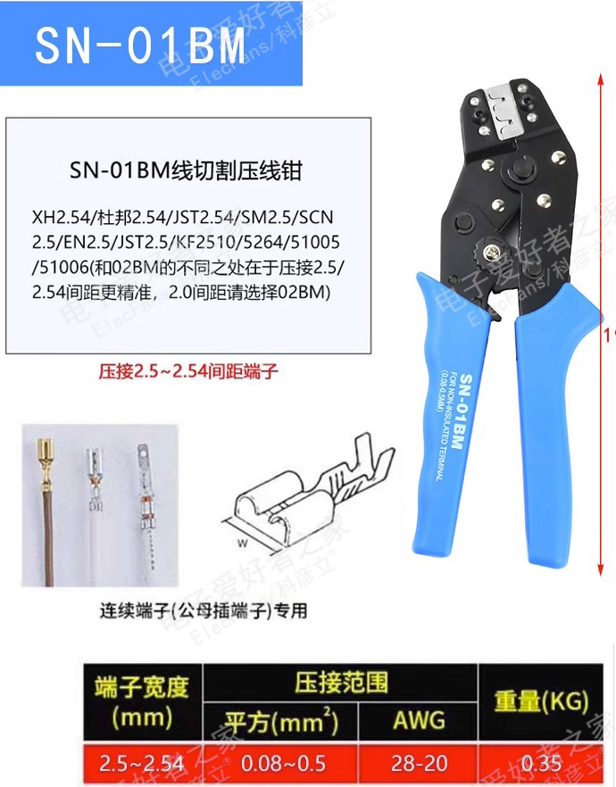

# PTOS031 DAT 

SN-01BM, This section Crimping Pliers can pressure between 2.5 and 2.54 pitch (0.08 - 0.5 mm^2) terminal including of
- Common used: XH 2.54, SM 2.54
- HA XHB / EH / SCN / 5264 / 250 / LGC / CH2.5 / EI / Primary Four P S11 / HR / YH025 / 35155 / 5102 / 5240 / SMH250/SMP250 / 2048HS / 25045HP / TJC8 / TJC8A / 5051/2510 / CH10 / 25415
  
In addition, the tool is sometimes pressure 43645,43020 / 43025 (3.0MM pitch) terminals are a good choice. Provided that the line is not pressure crude pressure.