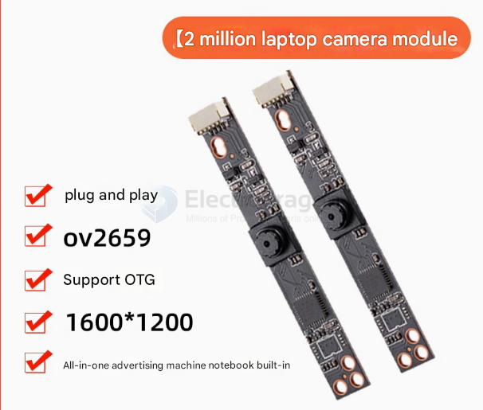
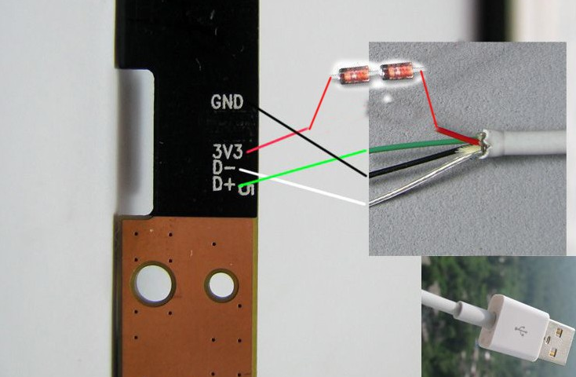
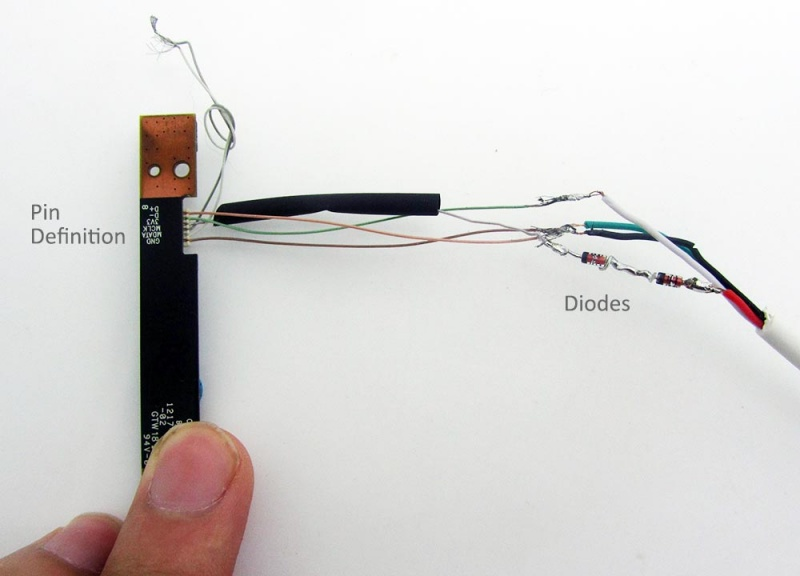
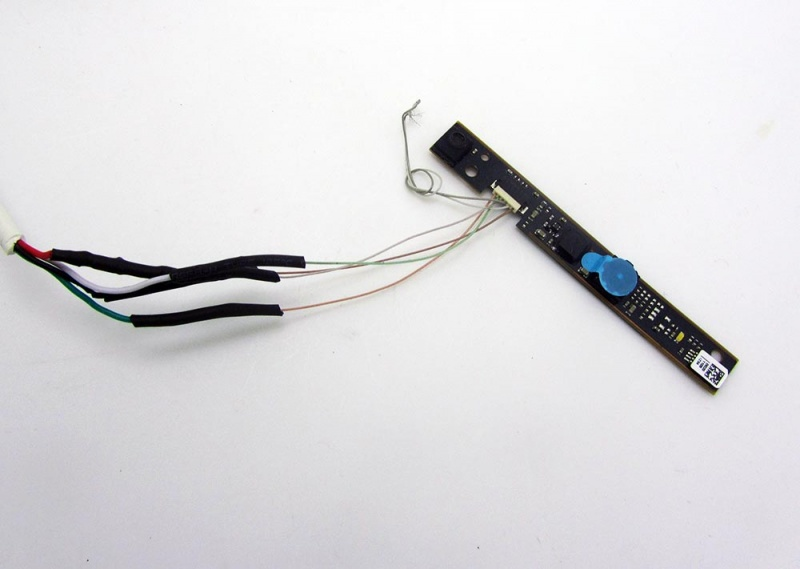
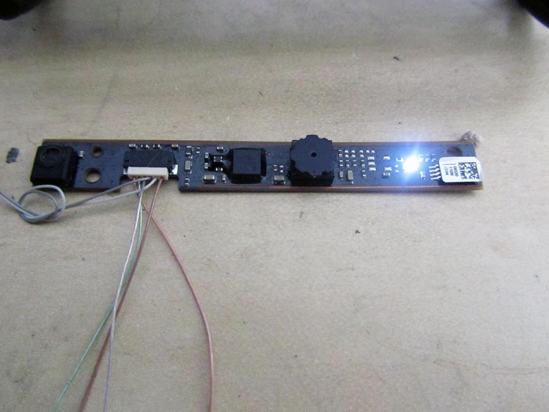
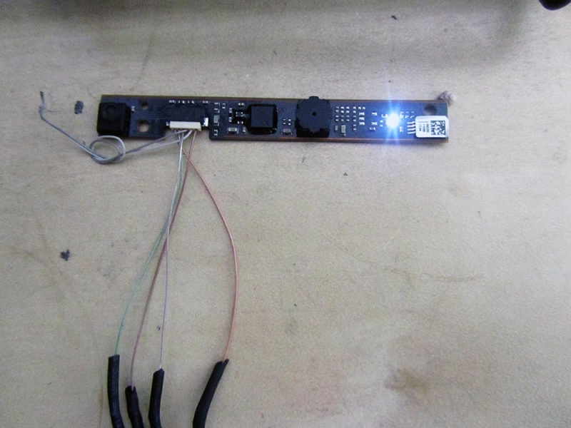
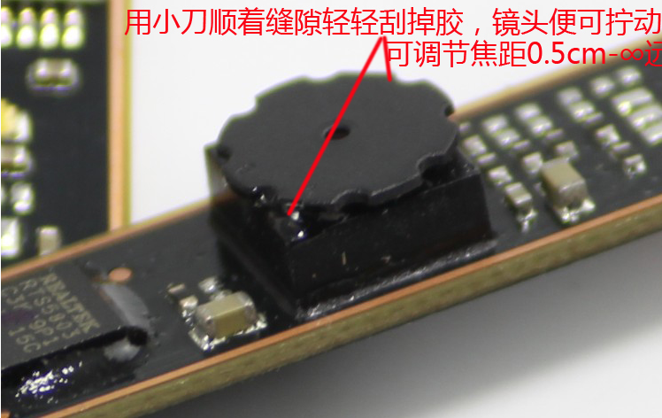

# SCM1002-dat 

## Info 
 
[product url - Laptop Build-in Camera PCB](https://www.electrodragon.com/product/0-3m-laptop-build-camera-board/)

## Board Images and Dimension

## Applications, category, tags, etc. 

- [[sensor-Camera-dat]] - [[UVC-dat]]

## Demo Code and Video

- https://www.youtube.com/watch?v=c_ZNW3fGdmc

## build guide 

== Build USB camera ==

Add didoes on VCC pin, each camera should have two pieces of the 1N4148 diodes!

don't forget to cover each wire with protective sleeves

working status 1 

working status 2 

Better cover with another sleeve for all wires finally

how to tune the lens distance manually 

## ref 

- Chicony 
 
- [[SCM1002]] - [[SCM]]
 
- legacy wiki page 
 

