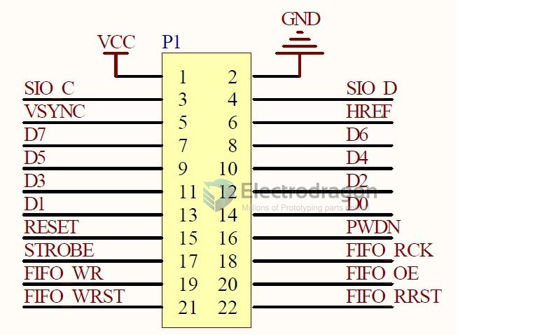

# SCM1009-dat

## Info 
 
[product url - OV7670 Camera Module [FIFO]](https://www.electrodragon.com/product/ov7670-camera-module-breakout-board-power-cable/)
 
## Applications, category, tags, etc. 

- [[Camera-dat]]

## Demo Code and Video

## Pins 

pin header 2 * 11 

- SIO_C
- SIO_D
- VSYNC
- HREF
- PCLK
- XCLK
- D0 ~ D7 
- Reset 
- PWDN

extra 
- strobe
- FIFO_RCK
- FIFO_WR
- FIFO_OE
- FIFO_WRST
- FIFO_RRST

## ref 

- [[SCM1009]] 
 
- legacy wiki page 
 
- [[FIFO-dat]]