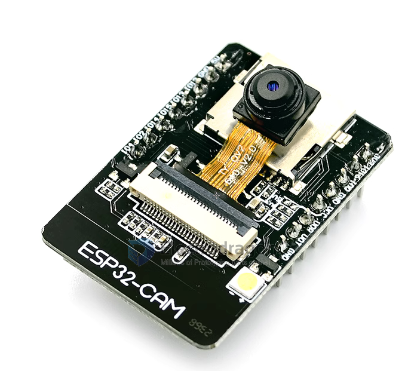
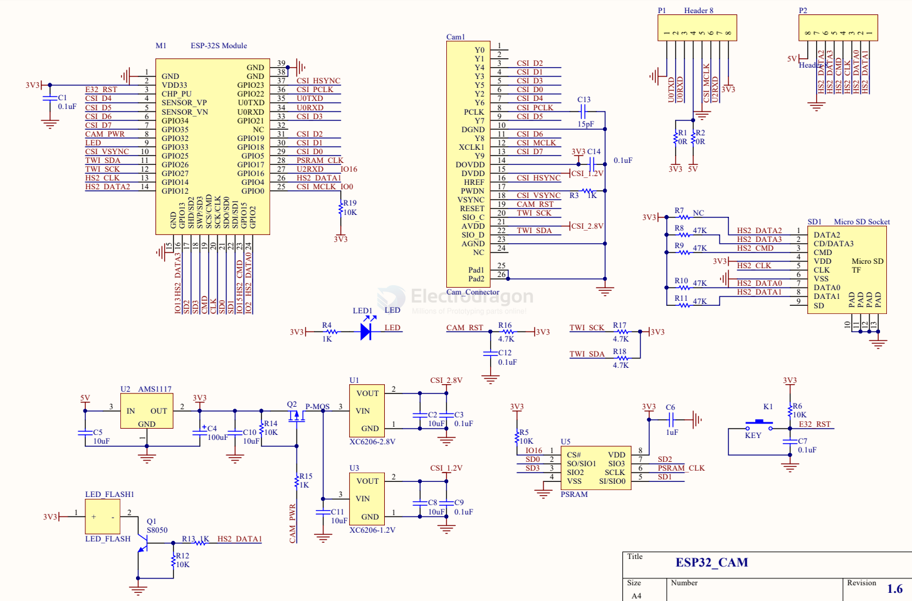
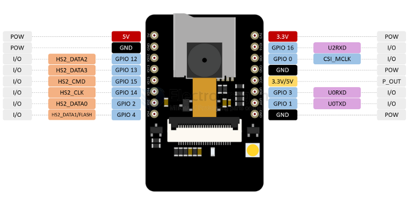

# SCM1030-dat 

## Info 

ESP32-CAM WiFi + Bluetooth Camera Module Development Board ESP32 With Camera Module OV2640
 
 

### Features:
 
- Ultra-small 802.11b/g/n Wi-Fi + BT/BLE SoC module
- Low-power dual-core 32-bit CPU for application processors
- Up to 240MHz, up to 600 DMIPS
- Built-in 520 KB SRAM, external 4M PSRAM
- Supports interfaces such as UART/SPI/I2C/PWM/ADC/DAC
- Support OV2640 and OV7670 cameras with built-in flash
- Support for images WiFI upload
-Support TF card
- Support multiple sleep modes
- Embedded Lwip and FreeRTOS
- Support STA/AP/STA+AP working mode
- Support Smart Config/AirKiss One-click distribution network
- Support for serial local upgrade and remote firmware upgrade (FOTA)
 
### Description:
 
The ESP32-CAM has a very competitive small-size camera module that can operate independently as a minimum system, measuring only 27*40.5*4.5mm, with deep sleep current and a minimum of 6mA.
ESP-32CAM can be widely used in various IoT applications. It is suitable for home smart devices, industrial wireless control, wireless monitoring, QR wireless identification, wireless positioning system signals and other IoT applications. It is an ideal solution for IoT applications.
ESP-32CAM is packaged in DIP and can be directly plugged into the backplane for quick production. It provides customers with a highly reliable connection method and is convenient for use in various IoT hardware terminals.

## SDK

### default serial demo 

    Initializing the camera module...Ok!
    Initializing the MicroSD card module... Starting SD Card
    Picture file name: /picture0.jpg
    Saved file to path: /picture0.jpg

### Setup with official codes 

- [[CAM-dat]] - [[OV2640-dat]]

pin define 

    #elif defined(CAMERA_MODEL_AI_THINKER)
    #define PWDN_GPIO_NUM  32
    #define RESET_GPIO_NUM -1
    #define XCLK_GPIO_NUM  0
    #define SIOD_GPIO_NUM  26
    #define SIOC_GPIO_NUM  27

    #define Y9_GPIO_NUM    35
    #define Y8_GPIO_NUM    34
    #define Y7_GPIO_NUM    39
    #define Y6_GPIO_NUM    36
    #define Y5_GPIO_NUM    21
    #define Y4_GPIO_NUM    19
    #define Y3_GPIO_NUM    18
    #define Y2_GPIO_NUM    5
    #define VSYNC_GPIO_NUM 25
    #define HREF_GPIO_NUM  23
    #define PCLK_GPIO_NUM  22

    // 4 for flash led or 33 for normal led
    #define LED_GPIO_NUM   4

## HDK 

## SCH 

- [[OV2640-dat]]

| L_Pin | custom  | M_Pin | custom  | R_Pin | custom         |
|-------|---------|-------|---------|-------|----------------|
| GND   |         | GND2  |         | GND   |                |
| 3V3   |         | 13    | microSD | 23    | CAM            |
| EN    |         | SD2   | PSRAM   | 22    | CAM            |
| 36    | CAM     | SD3   | PSRAM   | TXD0  |                |
| 39    | CAM     | CMD   |         | RXD0  |                |
| 34    | CAM     | CLK   |         | 21    | CAM            |
| 35    | CAM     | SD0   | PSRAM   | --    |                |
| 32    | CAM_PWR | SD1   | PSRAM   | 19    | CAM            |
| 33    |         | 15    | microSD | 18    | CAM            |
| 25    |         | 2     | microSD | 5     | CAM            |
| 26    | CAM     |       |         | 17    | PSRAM          |
| 27    | CAM     |       |         | 16    | PSRAM          |
| 14    | microSD |       |         | 4     | microSD, flash |
| 12    | microSD |       |         | 0     | CAM            |

### Pin Definitions 

- [[SD-dat]] - [[OV2640-dat]] - onboard [[PSRAM-dat]] from [[memory-dat]]

LEDs - [[LED-dat]]

| LEDs             | pin |
| ---------------- | --- |
| flashing LED     | 4   |
| common indicator | 33  |

to get free pins, remove card in [[SD-dat]] 

## Board Issues 

- For board version v1701, note do not connect pin "GND/R" aka GND3 to ground, otherwise it won't boot
- [refer for more information here. ](https://esp32.com/viewtopic.php?f=12&t=29647&sid=fed114d9e4f87cf6634c7ad145a5d8df&start=10)

## ref 

- default factory firmware demo [[ai-thinker_ESP32-CAM_DIO_V1.0_20180825.bin]]

- [[SCM1030]]
- https://wiki.ai-thinker.com/esp32-cam
- demo code - https://github.com/donny681/ESP32_CAMERA_QR
- use guide CN - https://github.com/donny681/ESP32_CAMERA_QR/wiki

- [[ESP-SDK-dat]] - [[ESP32-HDK-dat]] - [[ESP32-WROOM-dat]]

- [[AMS1117-dat]]

