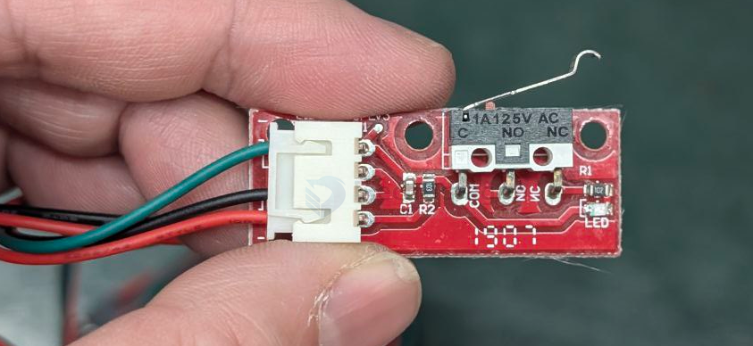
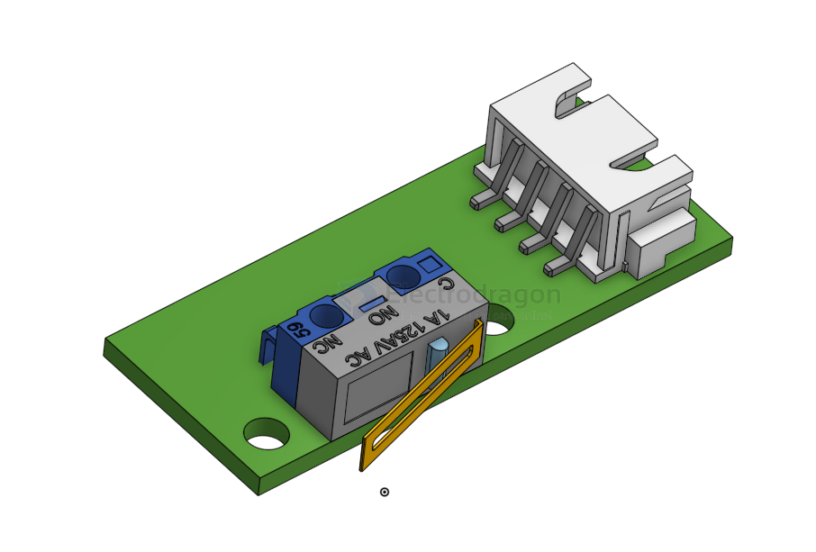
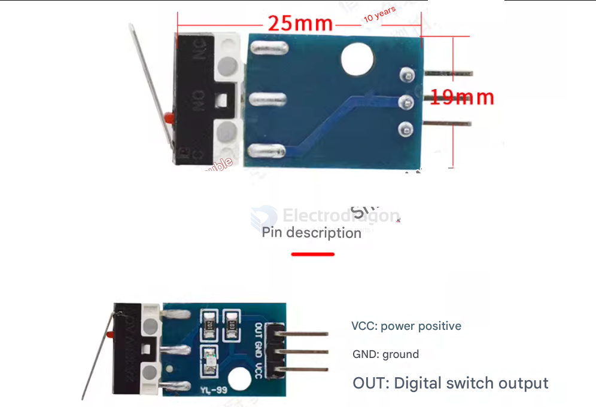
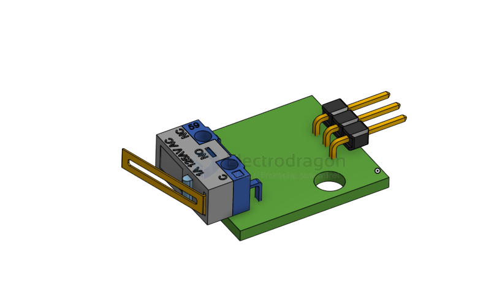

# SCU1004-dat

## Info 
 
- [[switch-dat]] - [[ISB-dat]] - [[ISB1030-dat]] - [[ISB1041-dat]] - [[SCU1004-dat]]

[mechanical Endstop ](http://reprap.org/wiki/Mechanical_Endstop)

[Mechanical Endstop Limited Switch](https://www.electrodragon.com/product/mechanical-endstop-limited-switch/)

- [[sensor-reflective-dat]]

## boards 

- pull up and status LEDs 
- hole size == 3mm 
- hole center distance  == 19mm

add - [[glue-hot-dat]] - [[glue-dat]]

## version V2 

## ref 

- [[reprap-dat]]
 
- [[SCU1014]] 