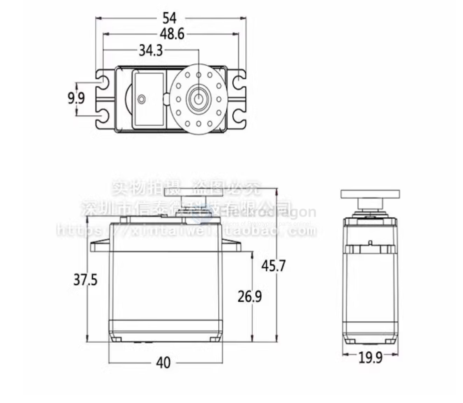
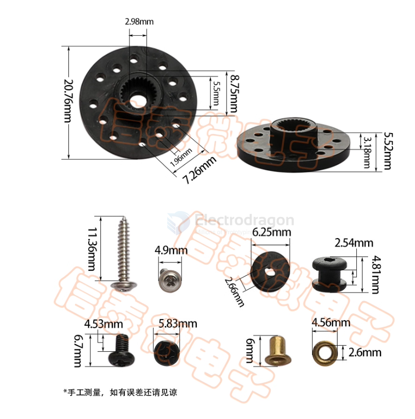
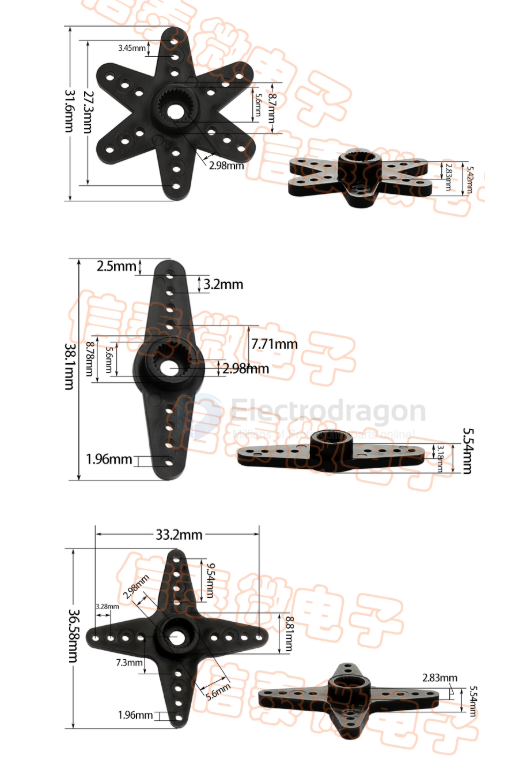

# SCU1012-dat

## Info

[product url - MG996R Servo Motor, 12KG High Torque](https://www.electrodragon.com/product/mg995-servo-motor-13kg-torque/)

all metal gears / 13KG.cm torque / 

### Board Map, Dimension, Pins, chip info, Use Guide, Setup Jumper, etc.

## Applications, categories, tags

- Biped robots, robotic hands, RC cars
- Suitable for fixed-wing model aircraft: 50–90 class methanol models and 26–50 cc gasoline fixed-wing models

## Demo code and video

- [[servo-dat]]

## MG995 / MG996R — Metal Gear High-Torque Servo

MG995 / MG996R are metal-gear servos with high torque suitable for RC cars, boats, robots and larger model aircraft.

### Specifications

| Item | Specification |
|---|---|
| Model | MG995 / MG996R |
| Gear material | Metal (copper) gears |
| Cable length | 30 cm (Signal = yellow, V+ = red, GND = brown) |
| Dimensions (L×W×H) | 40.7 × 19.7 × 42.9 mm |
| Weight | 66.2 g |
| No-load speed | 0.17 s / 60° @ 4.8 V; 0.13 s / 60° @ 6.0 V |
| Stall torque (working torque) | 13 kg·cm |
| Deadband | 4 µs |
| Connector | JR / FUTABA compatible |
| Operating voltage | 3.0–7.2 V |
| Operating temperature | -30 to +60 °C |
| Accessories included | Servo horns, mounting screws, vibration-damping sleeves, aluminum adapter |

## Accessories

## ref 

- [legacy wiki page](https://www.electrodragon.com/w/Servo)

- [[SCU1012]]