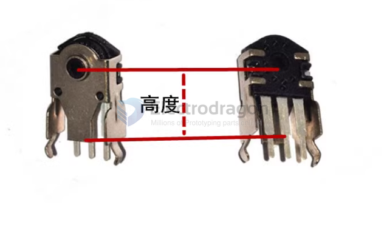

# SCU1015-dat

## QA 

Q: What is the height of the encoder on the mouse?
- A: If there are numbers engraved, you can read them directly. If there are no numbers engraved, you need to measure them. The specific measurement method is as shown in the figure below.

## ref 

- [[SCU1015]]