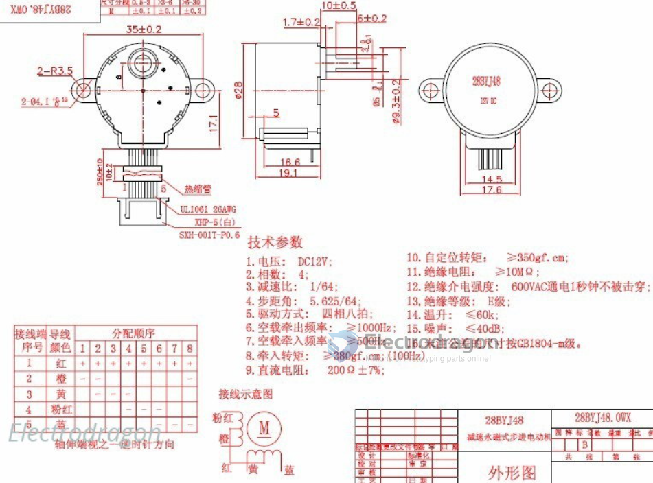
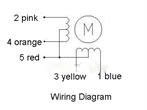
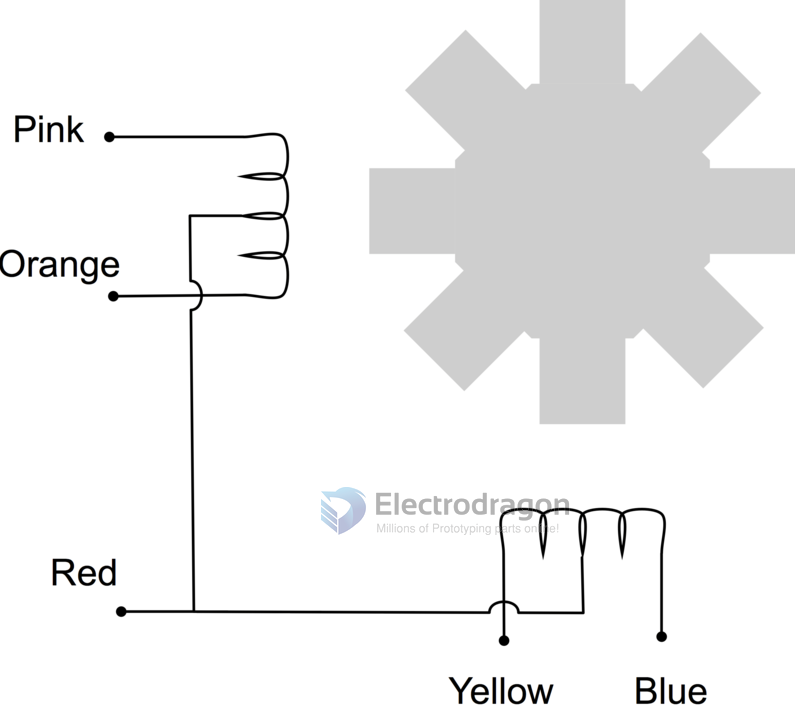
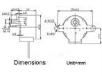

# SCU1024-dat 

[4-Phase 5-Wire Stepper Motor, 28BYJ-48-5V](https://www.electrodragon.com/product/5v-4-phase-5-wire-stepper-motor-gear-motor-28byj-48-5v/)

- legacy wiki page 1 - https://w.electrodragon.com/w/28BJY-48
- legacy wiki page 2 - https://w.electrodragon.com/w/Category:Stepper

## Specs 

## Wiring 

## ref 

- [[SCU1024]]

- Darlinton driver - [[ULN2003-dat]]