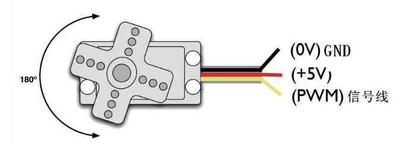

# SCU103-DAT 

[SG90 Micro Servo For Toy Contorl [Type]](https://www.electrodragon.com/product/micro-9g-servo-for-rc-helicopter-boat-plane-car/)

- Model: SG90 
- Weight 13 grams Angle 
- 90-180 degrees universal

- Red voltage 
- grey color ground wire 
- Orange is signal wire

### Technical data:
- Size: 21.5mmX11.8mmX22.7mm
- Weight: 9 grams
- No-load speed: 0.12 seconds/60 degrees (4.8V)
- Stall torque: 1.2-1.4 kg/cm (4.8V)
- Operating temperature: -30~~+60 degrees Celsius
- Dead zone setting: 7 microseconds
- Working voltage: 4.8V-6V

### Specs
- Product model MG90S
- Product size 22.8*12.2*28.5mmmm
- Product weight 13.6g
- Working torque 2KG/cm
- Response speed 0.11 seconds/60 degrees (4.8V
- Operating temperature 0°C-55°C
- Dead zone setting 5 microseconds
- Plug type JR, FUTABA common
- Rotation angle up to 90 degrees
- Servo Type Digital Servo
- Working current   
- Use voltage 5V
- Structural material Metal copper teeth, coreless motor, double ball bearings
- Accessories include steering wheel, cable length 30CM, fixing screws, damping rubber sleeves and aluminum sleeves and other accessories (see the actual picture for details)
- Scope of application Small and medium-sized electric model airplanes and other models.

## ref 

- [[servo-dat]]