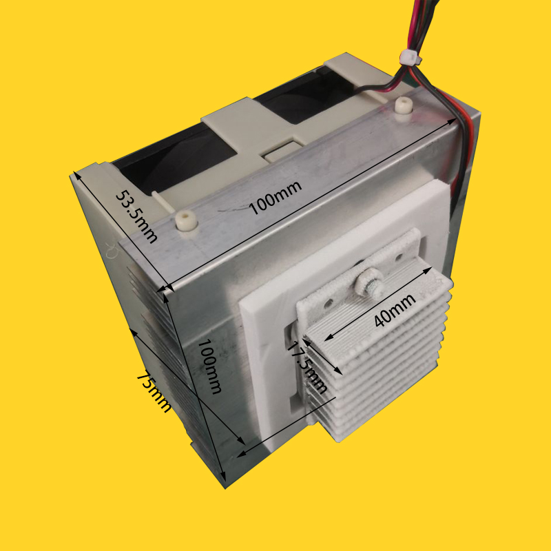
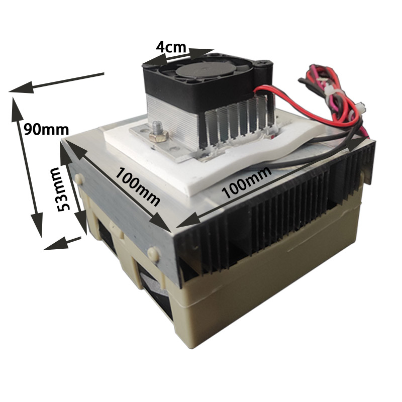
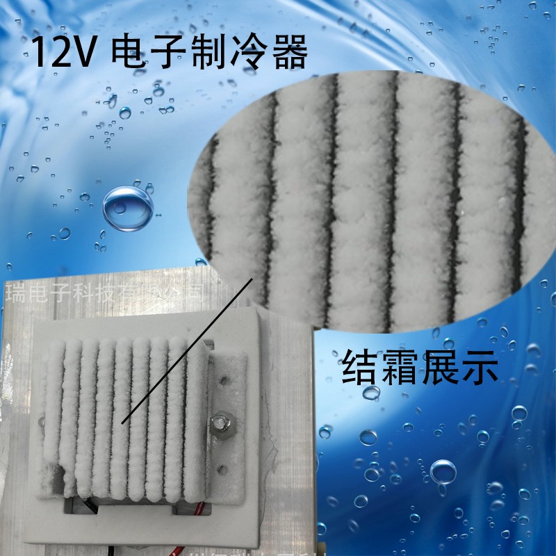
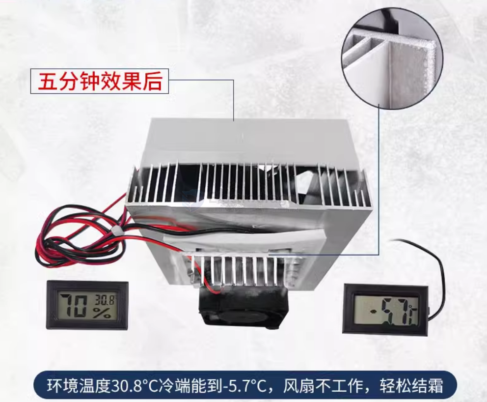
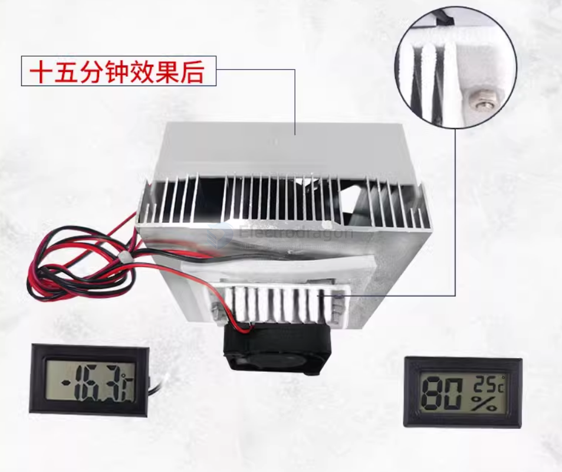
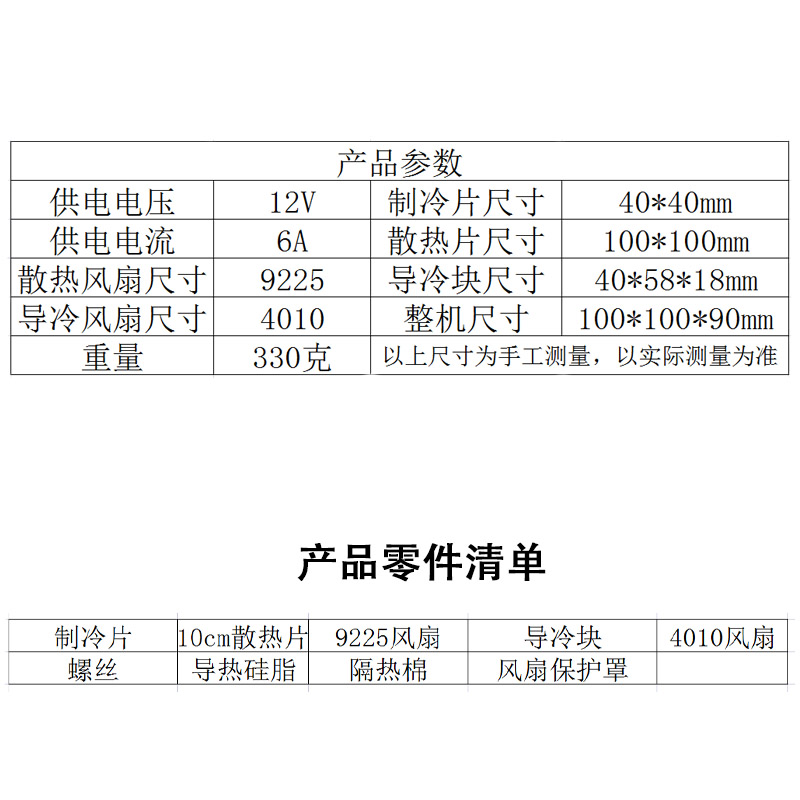

# SCU1038 DAT

## context

## FAQ 

Common problems with cold end frosting:

1. Low ambient temperature is required. Generally, frosting is more obvious when the ambient temperature is below 26°C (the temperature difference of some cooling plates is large)

2. It is related to the power supply. If you choose a 12706 cooling plate, it is recommended to use a power supply of 12V8A or above (some power supplies have false labels)

3. The cooling space should not be too large, the seal should be good, and a small insulation box is appropriate.

4. The heat dissipation of the hot end of the cooling plate should be good, and the thermal grease should be evenly applied (all four sides). The large fan should blow towards the heat sink (do not use the air inlet to suck next to the heat sink)

5. Do not turn on the cold end fan, so that the air flow is strong and the cold end temperature cannot be too low. However, if the cold end fan is turned on in a small sealed space, the effect will come out and the whole space will be cold.

## shipingment includes 

- 4010 internal flow fan 
- 9225 external cooling fan
- ~~[[TEC-12706]]~~ cooling peltiers are not included, please buy seperatly 
- 10CM heatsink 
- conduction mediator
- screws 
- Thermal Grease
- fan protective cover 
- Thermal insulation cotton

## specs 

## ref 

- https://www.electrodragon.com/product/tec1-12706-thermoelectric-peltier-cooler-12v-60w/

- [[cooling]] - [[Peltier-dat]] - [[SCU1038]]