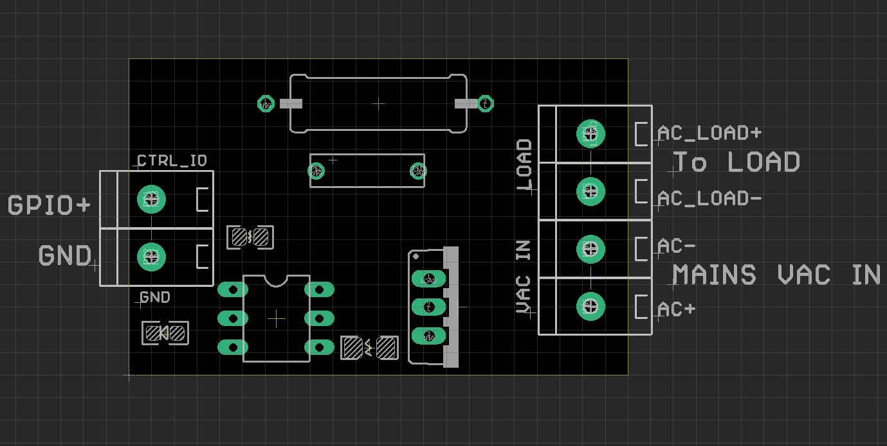

# SCU1041 DAT

https://www.electrodragon.com/product/triac-switching-drive-board-optical-isolated-bt136/

## Circuits 

- Includes Photocoupler driver MOC3063, Triac BT136V, AC Absorb RC circuits 

## Note 

### to use it on 3.3V input 
- by removing the LED, that was taking power from the GPIO dropping it below the minimum current required to open the gate. 

## Ref 

- [[BT136-dat]]

- https://www.electrodragon.com/w/Category:TRIAC

- demo video please see at [[TRIAC-dat]]

- [[SCU1041]]