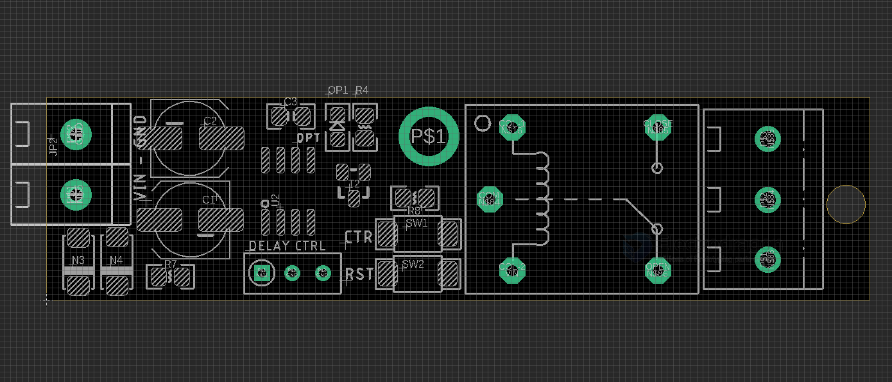

# SCU1044 DAT

legacy wiki page NE555 - https://www.electrodragon.com/w/NE555

- button CTR - rest NE555 chip * (?)
- button RST - reset timer 
- potentiometer - delay ctrl 
- LED opt - indicator relay status 

## calculation 

Delay time = T＝1.1RC. 

For example, 

    capacitor 47uf and  
    trim pot potentiometer 500K 
    T = 1.1 * 500 000 * 0.000047=25.85 seconds. (Max. )

- to change the delay time, tune the potentiometer 
- default capacitor - 47uf

## Demos 
https://twitter.com/electro_phoenix/status/1658391696416321536

## ref 

- [[NE555-DAT]] - [[mcu-relay]]