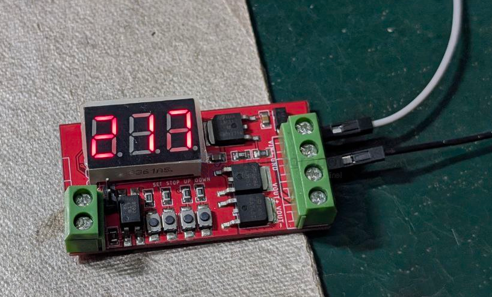

# SCU1048-dat

https://www.electrodragon.com/product/intermittent-switching-mosfet-module-mcu-control/

- [[N76E003-dat]] - [[LM317-dat]]

- [[mosfet-dat]] - [[AOD4184-dat]]

- [[segment-display-dat]]

[legacy wiki page](https://www.electrodragon.com/w/MCU_Relay)

## Board map 

board system voltage from [[LM317-dat]] == 5V 

VOUT++ == VIN++ 

VOUT-- == mosfet control ON/FF to GND 

template 

| set    | alt | pin  | pin  | alt | set     |
| ------ | --- | ---- | ---- | --- | ------- |
|        |     | P0.5 | P0.4 |     | S2=down |
|        |     | P0.6 | P0.3 |     |         |
|        |     | P0.7 | P0.2 |     |         |
|        |     | P2.0 | P0.1 |     | S3=stop |
|        |     | P3.0 | P0.0 |     |         |
| S1=set |     | P1.7 | P1.0 |     | S4=up   |
|        |     | GND  | P1.1 |     |         |
|        |     | P1.6 | P1.2 |     |         |
|        |     | VDD  | P1.3 |     |         |
| input  |     | P1.5 | P1.4 |     |         |

## SDK 

- default flashed firmware with starting counting down from 255 to 0 

## ref 

- [[MCU-relay-dat]]

- [[SCU1048]]