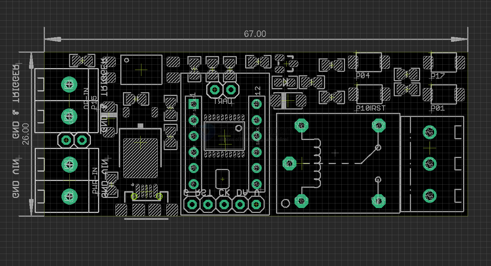

# SCU1050-dat

## Info 
 
[product url](https://www.electrodragon.com/product/intermittent-switching-relay-module-n76e003-mcu/)

## Board map 

relay trigger == P12 

external [[Optical-Coupler-DAT]] trigger == P15

setup buttons 

- P01
- P04
- P10 (or set to reset)
- P17 

Power supply VIN via [[LM317-dat]]

## ref 
 
- [[SCU1050]] 

## ref 

- [[n76e003-dat]] - [[LM7805-dat]]

- [[mcu-relay]] - [[MCU-relay-dat]]

