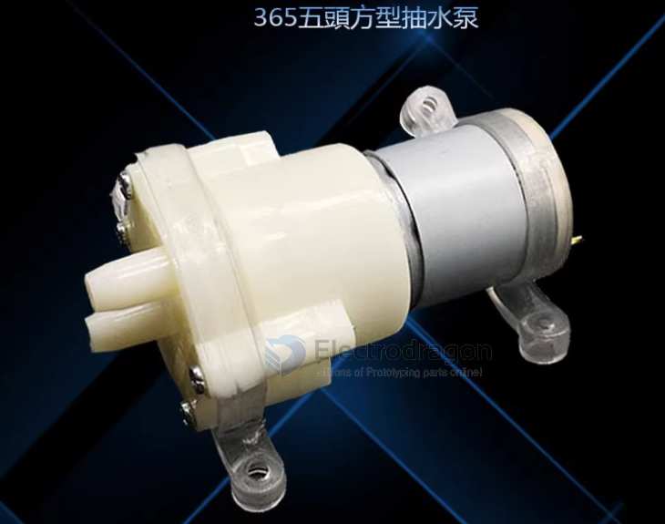

## SCU1056-dat

### Scope of use:

1. Tea sets, tea stoves, tea trays, water dispensers, etc. are used for example: branded tea sets, Tea Supreme. New merit. A good heart and a hemisphere. Shenhua. Jun Lake New Fly. Royalstar. The king Suoyang. Fuyi family. High-flying Oaks. Meiling. Dongzao Deyuan. Nine rings. Jin Kangshi. Wait for the first-class brand.

2. It has a wide range of uses and can be used in home appliances, medical care, model DIY, aquarium equipment, etc. It mainly realizes functions such as water pumping and cold water circulation.

 
### Features 

- Product model: 365 DC micro diaphragm pump
- The main parameters:
- Working voltage: DC 12V
- No-load current: 0.23
- Load: 450 HoA
- Maximum flow: 2-3 liters/minute
- Maximum pressure at water outlet: 1-2.5 kg
- Maximum lift: 1-2.5 meters
- Normal working time: 2-3 years.
- Maximum suction distance: 2 meters
- Water inlet and outlet diameter: outer diameter 8mm
- Motor length: 32MM
- Motor diameter: 28MM
- Pump length: 36MM
- Total length: 69MM
- Pump diameter: 40MM*35MM
- Weight: 111 grams

### Please note: 

The 365 diaphragm pump is a diaphragm pump that allows long-term idling. There are no mechanical parts and no wear in the pump body. Large water output, with self-priming function! It can be used as a water pump, fish tank water change, experimental model, inflatable swimming pool, tea set machine, oil pumping at grain and oil stations, car scrubbing, notebook water cooling, mineral water canning, etc. Air pump, aquarium gas and oxygen pump! Lower the voltage and use 3-5V voltage to make a computer heat circulation pump!