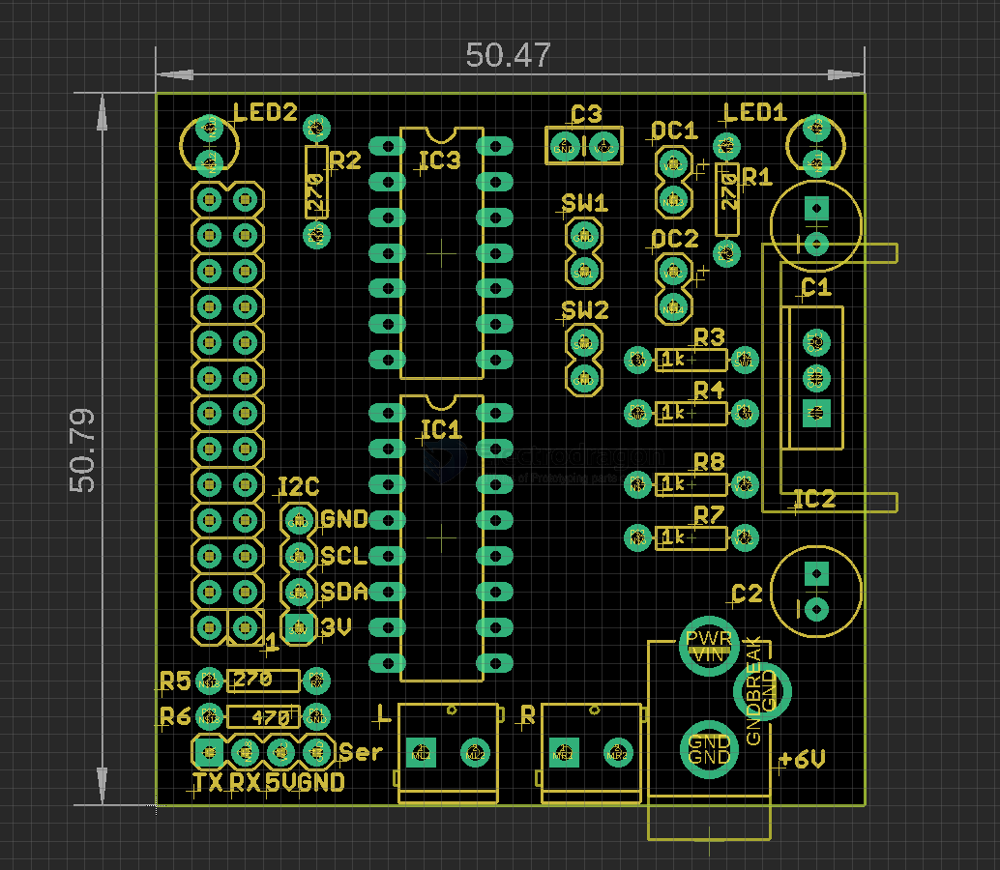

# SDR1011-dat

## Info

[product url - Raspberry Pi Motor Robot Shield Kit (L293D)](https://www.electrodragon.com/product/raspberry-pi-motor-robot-shield-kit-l293d/)

[legacy wiki page](https://www.electrodragon.com/w/Raspberry_Pi_Motor_Robot_Shield_Kit_(L293D))

### Board Map, Dimension, Pins, chip info, Use Guide, Setup Jumper, etc.

- [[L293-dat]] - [[RPI-SBC-dat]] - [[motor-driver-dat]]

- SW1 SW2 == switch to GPIO pin 21 and 23 == GPIO 9 and 11 == [[RPI-pin-dat]]

- drive pin GPIO 21 and 22 to external devices via [[74HC06-dat]]

## Applications, category, tags, etc. 

## Demo Code and Video

https://github.com/Edragon/RPI

## ref 

- [[SDR1011]] 

- [legacy wiki page ](https://www.electrodragon.com/w/Raspberry_Pi_Motor_Robot_Shield_Kit_(L293D))

