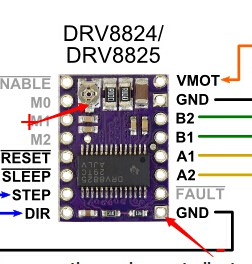

# SDR1040-DAT

## Info 
 
product url
 
## Applications, category, tags, etc. 
 
- [[motor-driver-dat]]

## Demo Code and Video
 

## Wiring: 
- refer to reprap wiki page
- blue line to digital pins 
- red and black lines to power pins VCC and GND
- grey pins can leave it to float

## Setup the mode

| MODE0 | MODE1 | MODE2 | Microstep Resolution |
| ----- | ----- | ----- | -------------------- |
| High  | High  | High  | 1/32 step            |
| High  | High  | Low   | 1/8 step             |
| High  | Low   | High  | 1/32 step            |
| High  | Low   | Low   | Half step            |
| Low   | High  | High  | 1/32 step            |
| Low   | High  | Low   | 1/4 step             |
| Low   | Low   | High  | 1/16 step            |
| Low   | Low   | Low   | Full step            |

## ref 
 
- [[SDR1040]] 
 
- legacy wiki page 
 
- [[Reprap-dat]] wiki page info. https://reprap.org/wiki/Pololu_stepper_driver_board#DRV8825

