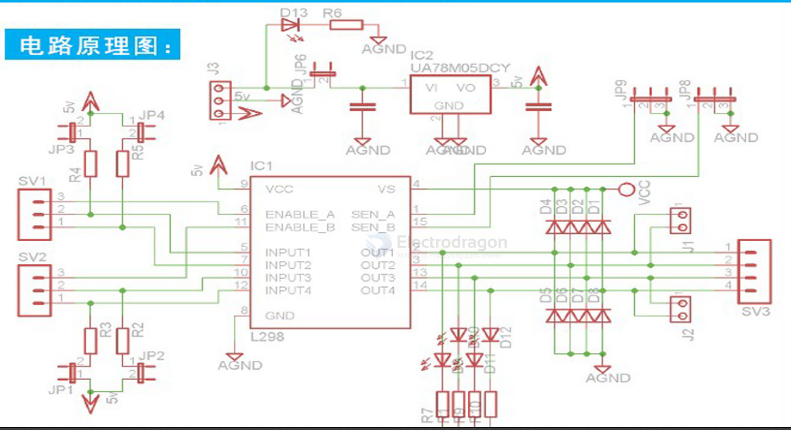
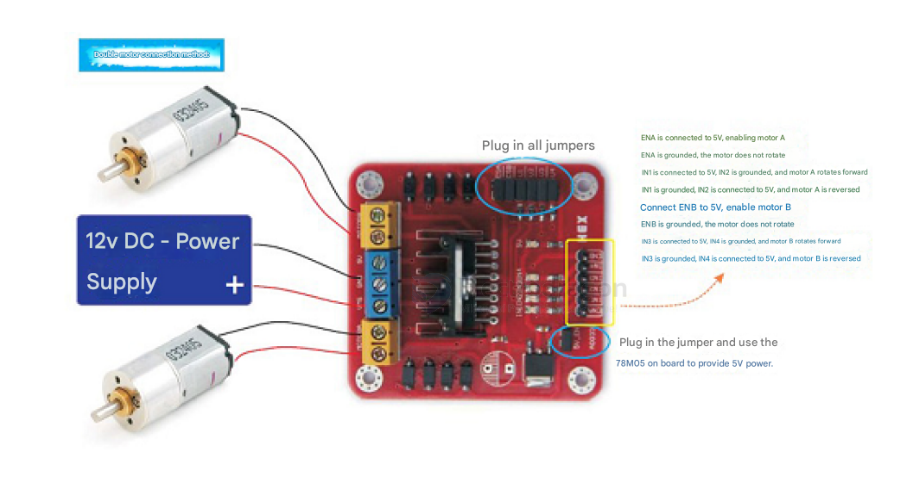
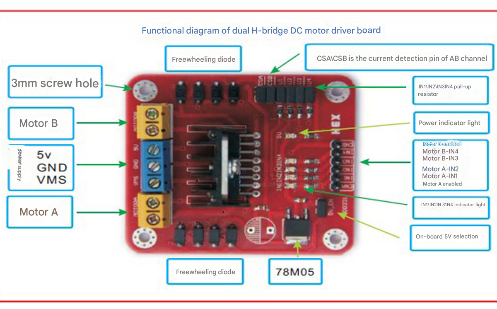

# SDR1048-dat

## Info 
 
[product url - L298N DC PWM Motor Driver Board, Stepper, L298](https://www.electrodragon.com/product/l298n-dc-pwm-motor-stepper-driver-board/)
 
## Applications, category, tags, etc. 
 
- [[motor-driver-dat]]

## SCH 

## Jumper

- CSA: Current sense pin for Motor A. A resistor can be connected in series here to sense current, or it can be directly jumpered to ground to disable current sensing.
- CSB: Current sense pin for Motor B. A resistor can be connected in series here to sense current, or it can be directly jumpered to ground to disable current sensing.
- 5V-EN: When the jumper is installed, the onboard 78M05 regulator operates, providing a 5V power output to supply the logic circuits. If the jumper is removed, an external 5V power supply is required to power the logic circuits.

## wiring 

## board map 

## Demo Code and Video

- [[L298-dat]]

## ref 
 
- [[SDR1048]] 
 
- legacy wiki page 
 

