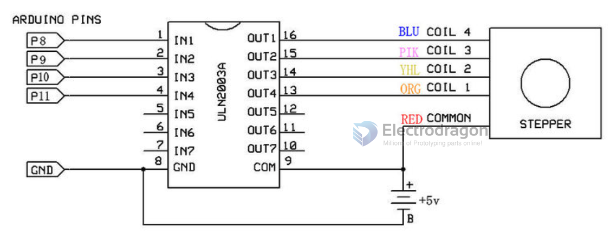

# SDR1050-dat

## Wiring with Arduino

Here are schematics showing how to interface a unipolar stepper motor to four controller pins using a ULN2003A, and showing how to interface using four TIP120's. 

* IN1-4 to the MCU IOs
* The pins in the white jack (from left to the right) are: Motor VCC, A, B, C, D (to the stepper motor)
* Power switch pins: GND, VCC, VCC, Motor VCC, use jumper to choose using shared VCC or not.

## SCH 

- 红色 =red; 
- 橙色=orange; 
- 黄色=yellow; 
- 紫色=purple; 
- 蓝色=Blue

## ref 

- datasheet chip [[ULN2003-dat]]

