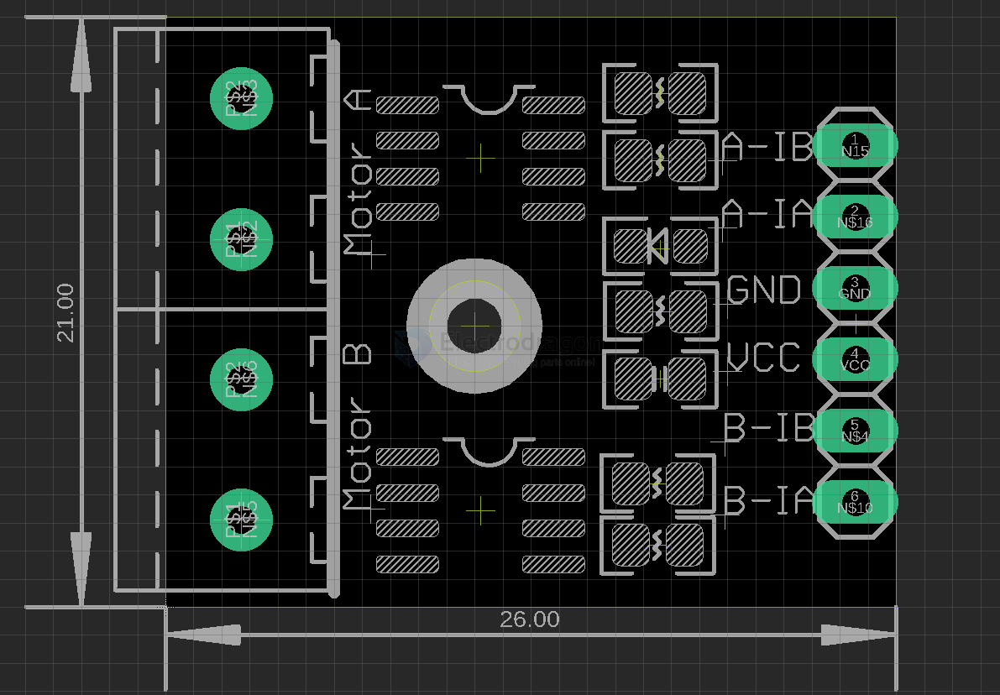

# SDR1056-dat.md

## Info

[product url - Motor Stepper Driver, 2x L9110](https://www.electrodragon.com/product/l9110-stepper-motor-driver-controller-board-for-arduino/)

### Board Map, Dimension, Pins, etc.

## Applications, category, tags, etc. 

The L9110 is a dual-channel motor driver module commonly used to control small DC motors or stepper motors in robotics and electronics projects. 

It allows you to control the direction and speed of motors by interfacing with microcontrollers like Arduino or Raspberry Pi. 

The module typically operates at low voltages (e.g., 2.5V to 12V) and is compact, making it suitable for lightweight applications. It uses an H-bridge circuit to enable forward and reverse motor control.

## Demo Code and Video

## ref 

- [[SDR1056]] - [[L9110-dat]]

- [legacy wiki page ](https://www.electrodragon.com/w/L9110_Stepper_Motor_Driver_Controller_Board_for_Arduino)
