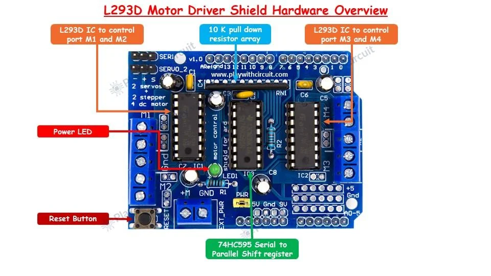
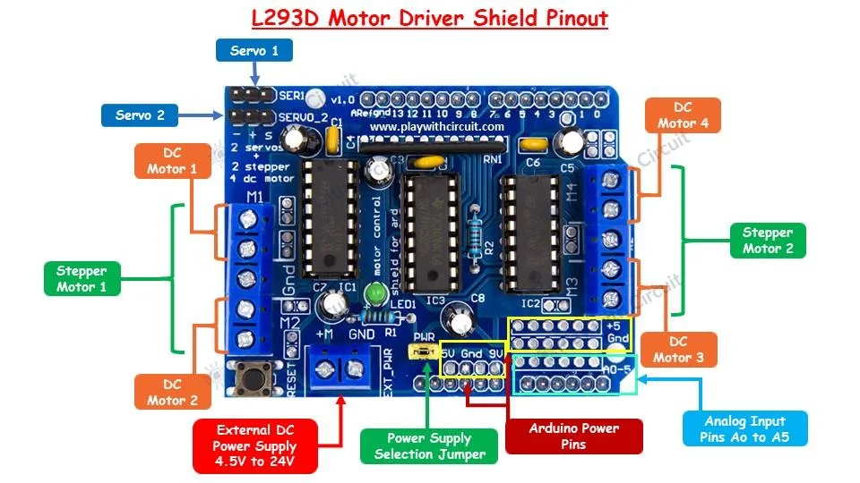
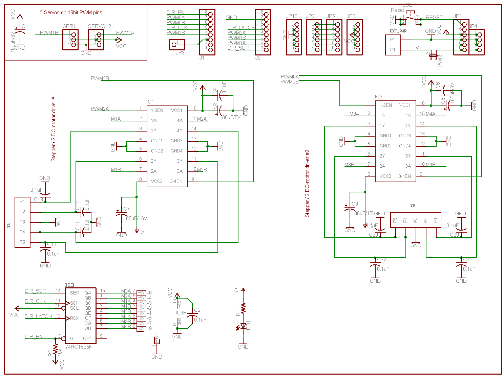

# SDR1060-dat.md

## Info
 
[product url - L293D Arduino Motor Shield](https://www.electrodragon.com/product/arduino-official-motor-drive-shield-l293d/)
 
This shield has an L293D IC, a dual H-bridge motor driver integrated circuit (IC), which allows it to drive 
- two DC motors, 
- a stepper motor, 
- or a servo motor. 
  

Key Features of the L293D Motor Driver Shield

- Dual H-Bridge IC: The L293D IC can control up to two DC motors or one stepper motor. It provides bidirectional control for two motors independently.
- Current Handling: Each channel of the L293D can handle up to 600mA of continuous current and peak currents up to 1.2A per channel.
- Voltage Range: The shield can operate at a wide range of voltages, typically from 4.5V to 36V.
- Protection Diodes: The shield has built-in diodes to protect the IC from back EMF generated by the motors.
- PWM Control: Supports Pulse Width Modulation (PWM) for speed control of the motors.

### Board Map, Dimension, Pins, etc.

Pin Definitions 

| Pin No. of Connector | Pin Name  | Arduino Pin | Functionality                                 |
| -------------------- | --------- | ----------- | --------------------------------------------- |
| J1-1                 | -         | D0          | -                                             |
| J1-2                 | -         | D1          | -                                             |
| J1-3                 | -         | D2          | -                                             |
| J1-4                 | PWM2B     | D3          | Enable pin of L293D IC controlling port M2    |
| J1-5                 | DIR_CLK   | D4          | Clock Pin of 74HC595                          |
| J1-6                 | PWM0B     | D5          | Enable Pin of L293D IC controlling port M3    |
| J1-7                 | PWM0A     | D6          | Enable Pin of L293D IC controlling port M4    |
| J1-8                 | DIR_EN    | D7          | Enable Pin of 74HC595                         |
| J3-1                 | DIR_SER   | D8          | Serial Data Input Pin of 74HC595              |
| J3-2                 | PWM1A     | D9          | PWM control pin of Second Servo Port(SERVO_2) |
| J3-3                 | PWM1B     | D10         | PWM control pin of First Servo Port(SER1)     |
| J3-4                 | PWM2A     | D11         | Enable pin of L293D IC controlling port M1    |
| J3-5                 | DIR_LATCH | D12         | Latch Pin of 74HC595                          |
| J3-6                 | -         | D13         | -                                             |
| J3-7                 | Gnd       | Gnd         | Ground                                        |
| J3-8                 | -         | Aref        | -                                             |

Schematic 

## Applications, category, tags, etc. 
 
## Demo Code and Video
 
## ref 
 
- [[SDR1060]] - [[L293-dat]]

- [[arduino-shields-dat]] - [[motor-driver-dat]]
 
- [legacy wiki page](https://www.electrodragon.com/w/L293D)
 