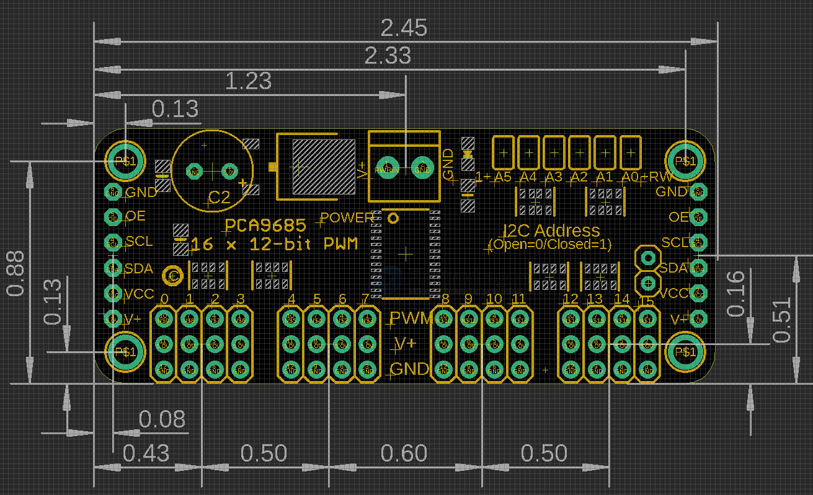

# SDR1062-dat

## Info 
 
[product url - 16 Channel PWM Servo Driver Module, IIC PCA9685 R2](https://www.electrodragon.com/product/16-channel-12-bit-pwmservo-driver-i2c-pca9685/)

board map 

## Applications, category, tags, etc. 

- [[motor-driver-dat]] - [[PCA9685-dat]] - [[servo-dat]] - [[I2C-dat]] - [[SDR1062-dat]] - [[PWM-dat]]

## Demo Code and Video

## ref 

- [[PCA9685-dat]] - [[power-protection-dat]]
 
- [[SDR1062]] 
 
- [legacy wiki page ](https://www.electrodragon.com/w/16-Channel_12-bit_PWM/Servo_Driver_,I2C_PCA9685)
 

