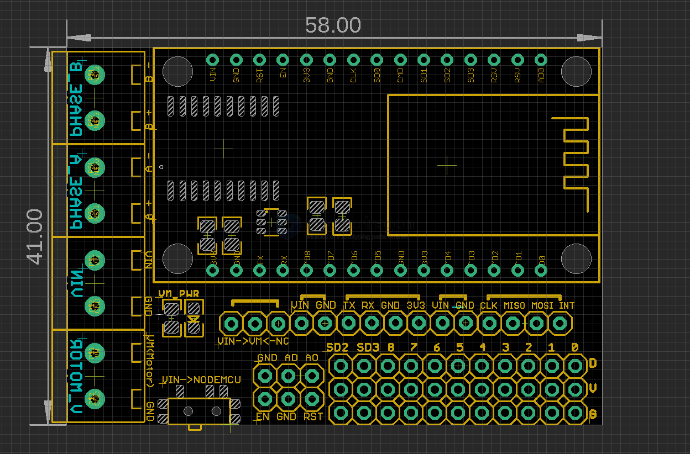
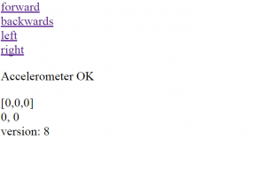

# SDR1064-dat

- [[motor-driver-dat]] - [[NWI1044-dat]]

## Info 
 
[product url - NodeMCU Motor Drive L293D Shield, WifiCar](https://www.electrodragon.com/product/wificar-nodemcu-motor-shield/)
 
## Applications, category, tags, etc. 

- [[ESP32-rc-car-dat]] - [[nodemcu-dat]] - [[RC-code-dat]]

## Board map 

- Motor Power Supply - VM (V_motor)
- Board Power Supply - VIN 

Input Pins: SD2, SD3, IO8, IO7, IO6, IO5, IO4, IO3, IO2, IO1, IO0

Motor Control: Phase_A, Phase_B, VIN, V_Motor

### Pins 

| nodemcu | right | func1 | func2 | [[SDR1064-dat]] |
| ------- | ----- | ----- | ----- | --------------- |
| D0      | I016  | USER  | WAKE  |                 |
| D1      | I05   |       |       | PWM_ A          |
| D2      | I04   |       |       | PWM_B           |
| D3      | I00   | FLASH |       | Motor_1         |
| D4      | I02   | TXD1  |       | Motor_2         |
|         | 3.3V  |       |       |                 |
|         | GND   |       |       |                 |
| D5      | I014  |       | HSCLK |                 |
| D6      | I012  |       | HMISO |                 |
| D7      | I013  | RXD2  | HMOSI |                 |
| D8      | I015  | TXD2  | HCS   |                 |
| D9      | I03   | RXDe  |       |                 |
| D10     | I01   | TXDE  |       |                 |
|         | GND   |       |       |                 |
|         | 3.3V  |       |       |                 |

### Shield setup

* Motor power supply (VM): 4.5V ~ 36V, can be powered separately
* Nodemcu Control power (VIN): 4.5V ~ 9V (10VMAX), can be powered separately
* Logic Operating current Iss: ≤60mA (Vi = L), ≤22mA (Vi = H)
* Driver IC: L293, drive = PWM (Pulse Wide Modulation)
* Drive part of the work current Io: ≤1.2A
* Maximum power dissipation: 4W (T = 90 ℃)
* Control signal input level: High: 2.3V≤VIH≤VIN; Low: -0.3V≤VIL≤1.5V
* ESP12E Dev Kit Control Port:
* GPIO0: Motor DirA, Button FLASH; GPIO5: Motor PWMA
* GPIO2: Motor DirB; GPIO4: Motor PWMB
* The screw terminal is labeled with the signal names.
* The push button switch connects VIN to the board.

## Demo Code and Video

- [V2 version demo video full load 5KG? ](https://t.me/electrodragon3/372)

- [[SDR1064-rover.ino]] - [[SDR1064-demo1.ino]]

[SDR1064 drive hacked toy rover by #esp8266](https://t.me/electrodragon3/364)

[demo video wifi car](https://www.youtube.com/watch?v=fbAj6JJp9aE)

[WiFiCar-NodeMCU](http://www.rudiswiki.de/wiki9/WiFiCar-NodeMCU)

[ESP8266: NodeMCU Motor Shield Review](http://blog.squix.ch/2015/09/esp8266-nodemcu-motor-shield-review.html)

https://github.com/Edragon/arduino-esp8266/tree/master/BSP/SDR/SDR1064-wifi-car

Internal control by [[SDR1064-dat]]

[Wfly #PPM console control toy rover](https://t.me/electrodragon3/369)

### Demo code JS Web Control 

https://github.com/Edragon/arduino-esp8266/tree/master/BSP/SDR/SDR1064-wifi-car

It is not simple to setup the WiFiCar with the provided software. You should have good knowledge of network handling, and Arduino and C programming. 

- Install the Arduino IDE (Integrated Development Environment) and the ESP8266 plugin Links #17 for programming the NodeMCU.
- With Arduino IDE upload my program wifi-car-AP.ino (Access Point mode) to the NodeMCU of the car.
- Power Up the NodeMCU, and try to find the WiFi hotspot (name: wifi-car) on IP address 192.168.4.1.
- Upload the provided JavaSript program wifi-carAP.js to the NodeMCU, via the URL http://192.168.4.1/upload (you will be asked for the File name/path).
#With an Android Smartphone connect with WLAN to the WiFicar Hotspot (name: wifi-car).
- Enter in your Web browser the URL http://192.168.4.1 . A HTML file is loaded (embedded in the C program) and the Java script file is loaded and executed.
- As soon, as you tilt the smartphone, the WiFicar will move in that direction.
- You should be able to see the interface similar to the right.

## ref 

- [[ESP-SDK-dat]]
 
- [[SDR1064]] 

- [[L293-dat]] - [[dc-motor-dat]] - [[wifi-dat]] - [[rover-dat]]
 
- [[logic-dat]]

- [legacy wiki page ](https://www.electrodragon.com/w/WifiCar)
 