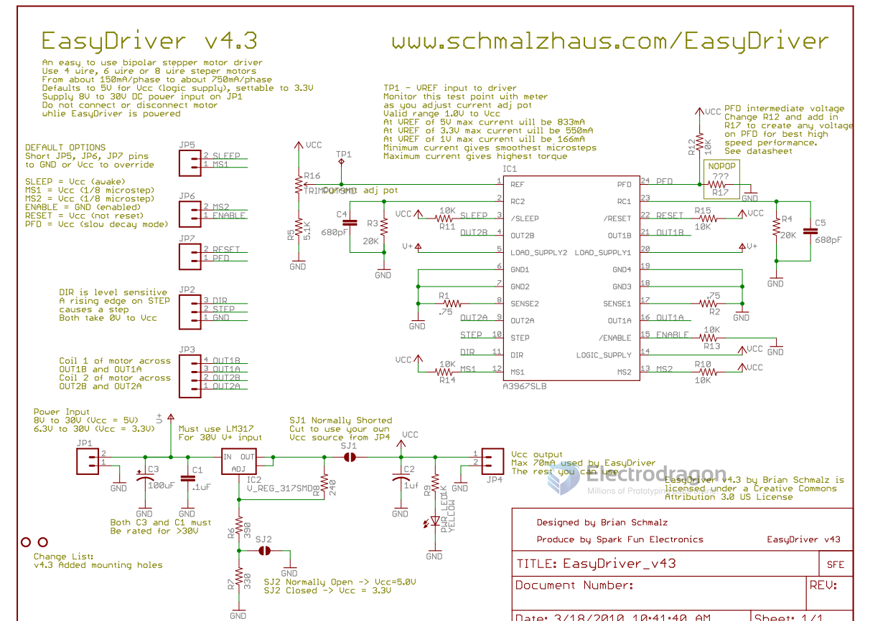

# SDR1067-dat 

- legacy wiki page - https://w.electrodragon.com/w/A3967

- https://www.electrodragon.com/product/easydriver-stepper-motor-driver/

## Wiring 

## SCH 

### Pin Definitions 

- ms1 and ms2 is a stepper motor subdivision resolution selection logic input;
- dir is the choice of opening direction of the motor;
- reset chip for resetting the initial value, block all external output;
- step is the pulse input port;
- out1a, out1b, out2a, out2b to h bridge two output ports;
- enable to enable terminal;
- sleep the sleep mode;
- sense1, sense2 are the h bridge current sensing resistor;
- ref is a reference voltage;
- gnd is the logic ground and power ground;
- rc1, rc2 are the h bridge fixed deadline for the analog input.

## Note Caution:

- Do not connect or disconnect a motor while the driver is energized. This will cause permanent damage to the A3967 IC.
- Better use high power supply when drive high power motors, voltage should be NOT over 30V

## demo 

- https://www.youtube.com/watch?v=wuBXvucLmwU

## ref 

- [[A3967-dat]] - [[stepper-dat]]

- [[SDR1067]] - [[stepper]]

