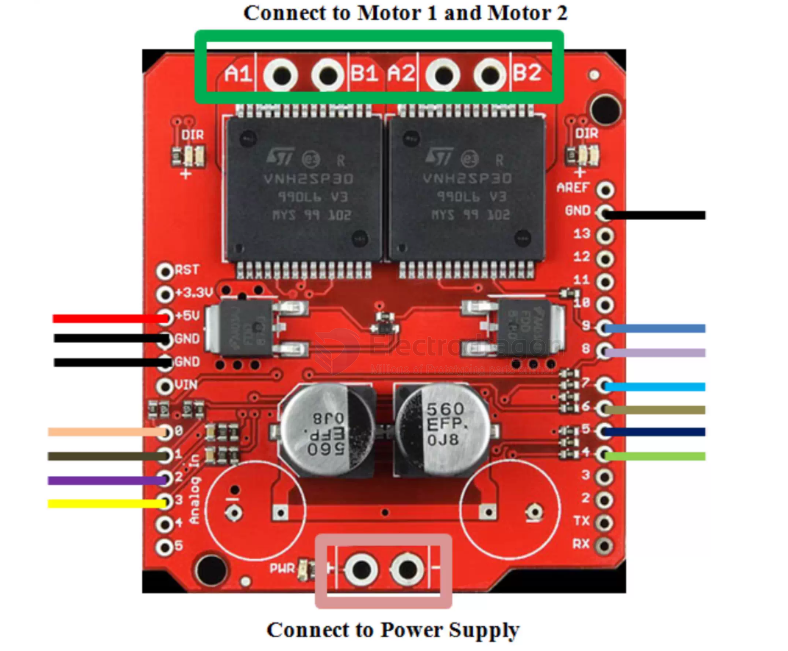
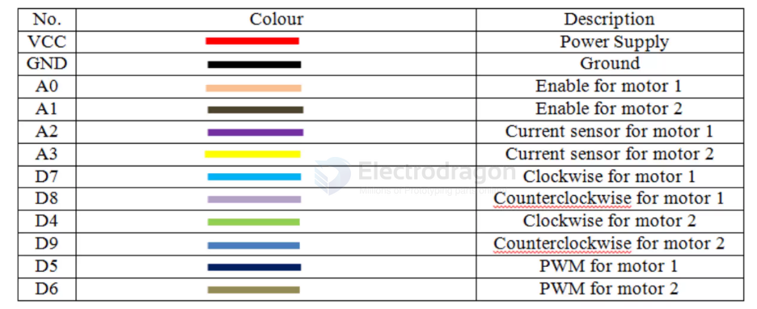
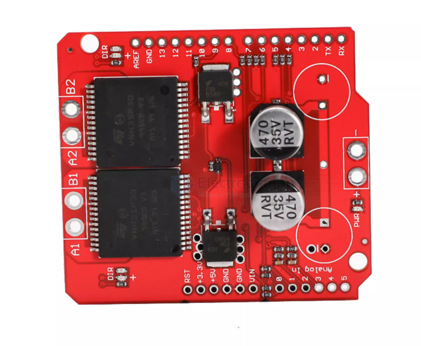
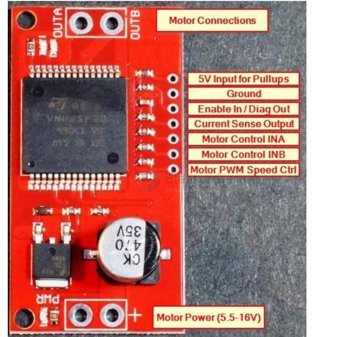

# SDR1070-dat

[Monster Moto Arduino Shield, VNH2SP30](https://www.electrodragon.com/product/monster-moto-shield-vnh2sp30/)

- [[VNH2SP30-dat]]

## wiring 

硬件引脚排列
AO：电机1的使能引|脚
A1：电机2的使能引|脚A2：电机电流传感器1
A3：电机电流传感器2
D7：顺时针（CW）表示电机1D8：电机1的逆时针 (CCW)
D4：顺时针（CW）表示电机2D9：电机2的逆时针(CCW)
D5：用于电机1的PWM
D6：用于电机2的PWM

使电机转动：

电机0
- 停止：D70, D80&D71，D71
- CCW : D70, D81
- CW: D71, D80
电机1
- 停止：D40，D90&D41，D91
- CCW : D40, D91
- CW: D41, D90

大电流 30A VNH2SP30步进电机驱动模块大电流 30A 步进电机驱动

描述：

- 这是一款专为大马力电机驱动的模块，模块强大的性能使其只需要一对VNH2SP30就可代替L298H桥提供全桥电机驱动，同时我们加强了电路的负载能力使其可以驱动一对大电流电机！模块输入端和电机接口端都采用了5mm的接口端子，使其方便连接大规格的电线。当需要用到超高电流的场合时，可将电线直接焊接到模块上代替
- 用接线端子连接（视情况而定）。当驱动电流大于扇。
- 6A时芯片就会发热，为了提高性能，最好接个散热片或散热风

模块特性：
- 最大输入电压：- 16V
- 峰值驱动电流：- 30A 
- 可持续启动电流：- 14A
- 最大 PMW频率：20 kHz输出阻抗仅为 19m Ω
- 过电流可通过 arduino 模拟输入脚检测带温保护过压和欠压保护

## ref 

https://www.electrodragon.com/w/Monster_Moto_Arduino_Shield_VNH2SP30

- [[SDR1070]]