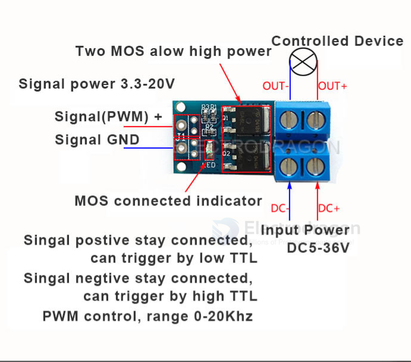

# SDR1073-dat

[High Power MOSFET Drive Module, PWM Control](https://www.electrodragon.com/product/high-power-mosfet-drive-module-pwm-control/)

- [[AOD4184-dat]]

## functions 

### Two Control Mode

| Signal +    | GND         |
| ----------- | ----------- |
| constant ON | trigger     |
| trigger     | constant ON |

- PWM mode, pwm frequency 0 ~ 20Khz

### legacy wiki page

- https://w.electrodragon.com/w/Category:Mosfet

### ref

- [[SDR1073]]
