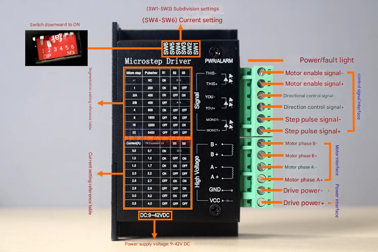
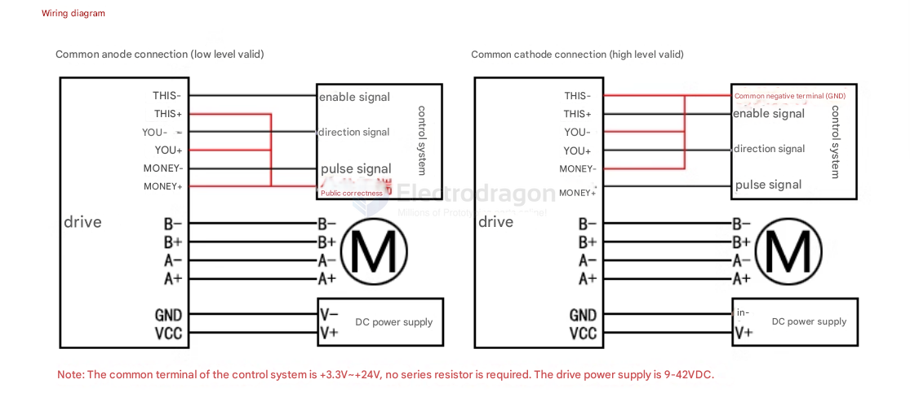
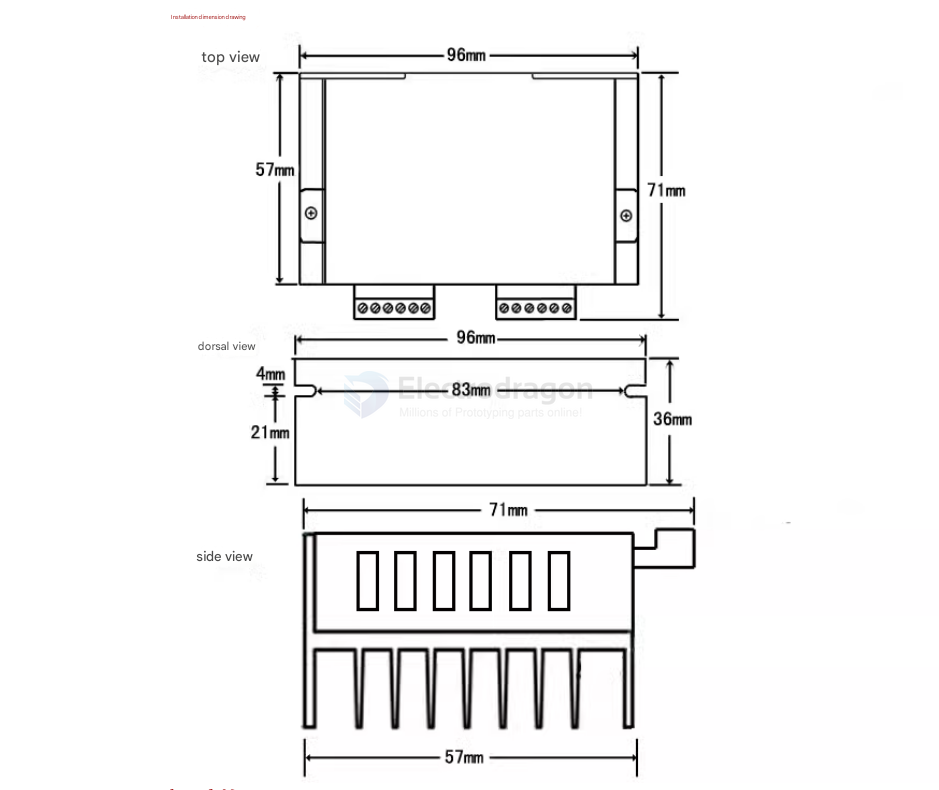

# SDR1076-dat

## Info

[product url - TB6600 Stepper Drive Mstep-32, 4A, 42VDC](https://www.electrodragon.com/product/tb6600/)

- [[TB6600-dat]]

### Board Map, Dimension, Pins, etc.

#### Product Features

- DC 9-42V power supply (recommended 12-24V)
- Control signal input voltage **3.3V-24V universal**
- 6 subdivision precisions available
- Output peak current up to **4.0A** (suitable for 1.8NM and below 57, 42 stepper motors) - [[torque-dat]]
- H-bridge bipolar constant current drive
- Input signal high-speed optocoupler isolation
- Built-in temperature protection and overcurrent protection
- Automatic half-current to reduce heat
- Motor noise optimization function
- Compact size saves space

Electrical environment

- Cooling method: Natural cooling or forced air cooling.
- Occasion: Do not place it next to other heating equipment. Avoid dust, oil, corrosive gas, high humidity and strong earthquake. Combustible gas and conductive dust are prohibited.
- Humidity: 40-90% RH
- Vibration: 10-55Hz/0.15mm
- Storage temperature: -20-65℃
- Weight: 0.15KG

#### wiring to use 

#### dimension 

## Applications, category, tags, etc. 

## Demo Code and Video

[Demo video avaialble here.](https://www.youtube.com/watch?v=ICeuOcP2WvY)

## ref 

- [[SDR1076]] 

- [legacy wiki page ](https://www.electrodragon.com/w/Category:Driver_Board)

