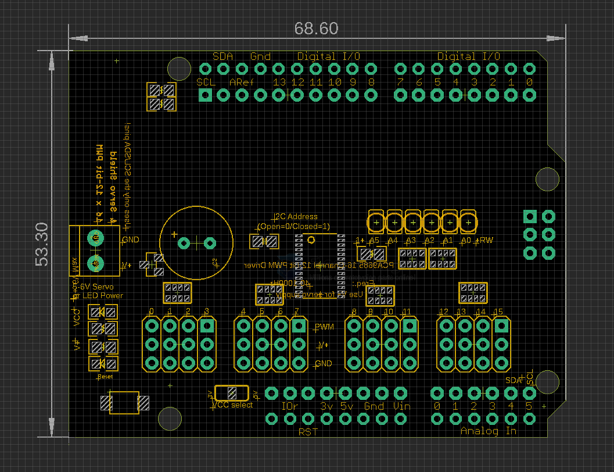

# SDR1090-dat

[IIC PWM Servo Driver Arduino Shield, PCA9685](https://www.electrodragon.com/product/pca9685-arduino-servo-shield/)

[legacy wiki page](https://www.electrodragon.com/w/16-Channel_12-bit_PWM/Servo_Arduino_Shield)

board map 

chip == [[PCA9685-dat]]

- Using only two I2C pins, control 16 free-running PWM outputs!
- 6 address select pins, You can even stack up 62 shields to control up to 992 PWM outputs, you can control a lot of servos or LEDs.
- Because I2C is a shared bus you can also connect other I2C devices and sensors to the SCL/SDA pins as long as their addresses don’t conflict (this shield has address 0x40)
- Independent  power steering, largest input V + 6V
- Logic signals and logic output 3-5v power independent
- Frequency 40-1000Hz, adjustable frequency PWM up to about 1.6 KHz
- Number of channels: 16 channels
- Resolution: 12-bit resolution for each output – for servos, that means about 4us resolution at 60Hz update rate
- arduino libraries include examples avaialble.
- There’s an I2C-controlled PWM driver with a built in clock. That means that, unlike the TLC5940 family, you do not need to continuously send it signal tying up your microcontroller, its completely free running!
- Configurable push-pull or open-drain output
- Three pins signal-VCC-GND design.
- Stackable design for arduino
- 220ohm resistors for all the output, protective design for driving LEDs.

## functions 

- [[PCA9685-dat]] - [[servo-dat]] - [[I2C-dat]] - [[arduino-shields-dat]] - [[motor-driver-dat]]

## ref 

== [[DAS1072-dat]]

