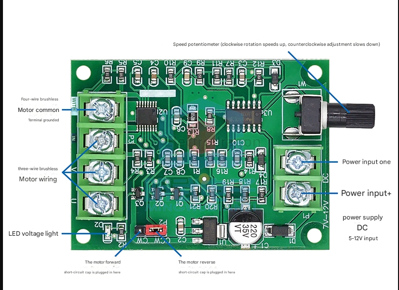
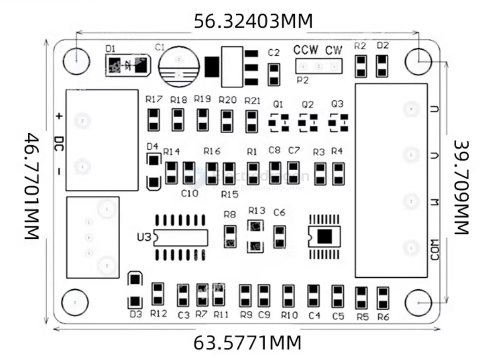

# SDR1106-dat

## Info 
 
[product url](https://www.electrodragon.com/product/small-bldc-brushless-motor-drive-board-esc-12v-1-2a/)

- [[DRV11873-dat]]

Applications: This driver board can drive micro 3-wire or 4-wire Hall-free brushless motors such as hard disk brushless motors and optical drive brushless motors.

This driver board can drive micro 3-wire or 4-wire Hall-less brushless motors such as hard disk brushless motors and optical drive brushless motors. 

The driver board has reverse voltage protection, overcurrent protection, short circuit protection, simple wiring, and worry-free use. 

The hard disk motor can rotate with a voltage of 7-12V. The higher the voltage, the faster the speed, and the peak value can reach about 10,000 revolutions. 

## Dimension 

## ref 

- [[Motor-dat]]

- [[BLDC-dat]]