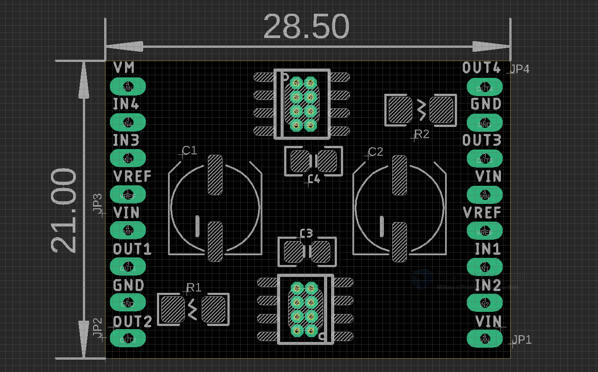

# SDR1109-dat

[TB67H450 2CH DC Brushed Motor Drive Board](https://www.electrodragon.com/product/tb67h450-2ch-dc-brushed-motor-drive-board-50v-3-5a/)

- [[TB67H450-dat]] - [[motor-driver-dat]]

https://toshiba.semicon-storage.com/ap-en/semiconductor/product/motor-driver-ics/brushed-dc-motor-driver-ics/detail.TB67H450FNG.html

## VREF 

- on board RS == 0.15R 

- I_LIMIT ≈ VREF / (3 × RS)

- if Vref = 5V, I_LIMIT = 5 / (3 * 0.15) = 11.11A (theoretically), but max current capability of this chip is 3.5A

- if Vref = 1.5V, I_LIMIT = 1.5 / (3 * 0.15) = 3.33A (preferable setup )

- if Vref = 1V, I_LIMIT = 1 / (3 * 0.15) = 2.22A

## ref 

- [[motor-driver-dat]] 

- [[SDR1109]]

