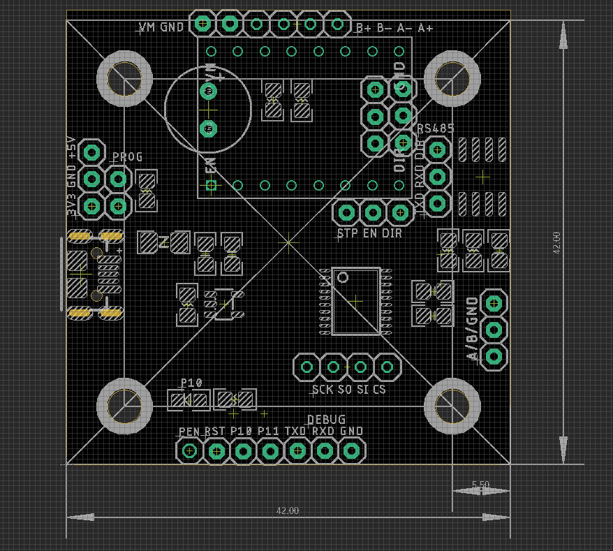

# SDR1113-DAT

- [[CH554-DAT]]

- [[rotating-magnetic-field-DAT]]

[Based on DRV8825 drive board, or A4988 board. Please buy it alone here.](https://www.electrodragon.com/product/drv8825-stepper-drive-board-ramps-compatible/)

- [[DRV8825-dat]] - [[A4988-dat]] - [[motor-driver-dat]]

legacy wiki page - [stepper back installation](https://w.electrodragon.com/w/Stepper_Back_Installation)

## Pin Definitions 

| Functions | Pins | Group       |
| --------- | ---- | ----------- |
| P10_LED   | P1.0 | Indicator   |
| RS485_DIR | P1.2 | RS_485      |
| STEP_DIR  | P3.3 | Motor_drive |
| STEP_EN   | P3.5 | Motor_drive |
| STEP_STP  | P1.3 | Motor_drive |
| U1_RXD    |      | RS_485      |
| U1_TXD    |      | RS_485      |

## demo code

- not yet have complete integrated demo 
- but each subfunctions demo available in private git: https://github.com/Edragon/WCH_CH55X-APP