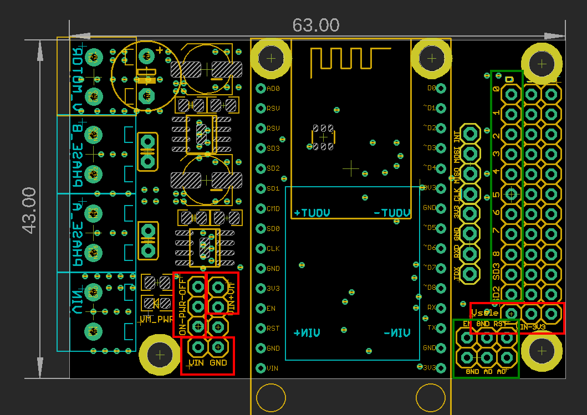

# SDR1117-dat

## Info

product url - RC WIFI Rover Motor Board V2

the board need stackable control board [[NWI1044-dat]]

The old version available here. [[SDR1064-dat]]

### Board Map, Dimension, Pins, chip info, Use Guide, Setup Jumper, etc.

board map and jumpers 

- leftside-bottom-redbox == VIN-GND for VIN extra power supply 
- leftside-left-redbox == Power ON/OFF switch for board 
- leftside-right-redbox == Connect VIN to V_MOTOR, never do it and please check triple before doing so, VIN only accept up to 9V for [[NWI1044-dat]]
- rightside-redbox == VIN for D0~SD2 power supply, either VIN or 3V3
- rightside-top-greenbox == D0~SD2 IOs 
- rightside-bottom-greenbox == RST GND EN / A0 AD GND (bug print)

- [[NWI1044-dat]] - [[nodemcu-dat]] - [[ESP8266-HDK-dat]] - [[ELRS-board-dat]]

- [[MP1584-dat]]

| custom | func  | left | right | func               | custom       |
| ------ | ----- | ---- | ----- | ------------------ | ------------ |
|        |       | AO   | D0    | IO16               |              |
|        |       | RSV  | D1    | IO5                | motor1A      |
|        |       | RSV  | D2    | IO4                | motor2A      |
|        | xIO10 | SD3  | D3    | IO0u               | motor1B      |
|        | xIO9  | SD2  | D4    | IO2u, LED on board | motor2B      |
|        |       | SD1  | 3V3   |                    |              |
|        |       | CMD  | GND   |                    |              |
|        |       | SDO  | D5    | IO14               |              |
|        |       | CLK  | D6    | IO12               | [[ELRS-dat]] |
|        |       | GND  | D7    | IO13               | [[ELRS-dat]] |
|        |       | 3V3  | D8    | IO15d              |              |
|        |       | EN   | D9    | IO3 - RXD0         |              |
|        |       | RST  | D10   | IO1 - TXD0         |              |
|        |       | GND  | GND   |                    |              |
|        |       | Vin  | 3V3   |                    |              |

## Applications, category, tags, etc. 

- [[Rover-dat]], [[DRV8871-dat]]

expanding PCB by [[PCB-accesories-dat]]

## Demo Code and Video

- [loading 5KG rover](https://youtube.com/shorts/swxmQqGnBrU?si=fHXPVpV-As7fMK2J)

- tested 12V power supply == 5S [[li-battery-dat]] - [[battery-dat]]

## ref 

- [[motor-driver-dat]]

- [[SDR1117]]

- [[ELRS-dat]] - [[inverter-dat]] - [[DRV8871-dat]]