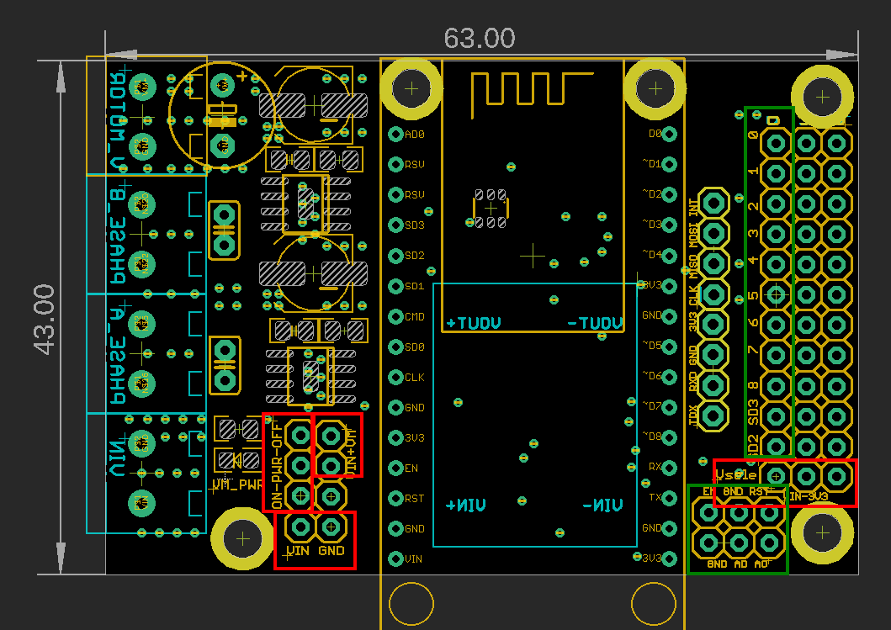

# SDR1117-dat

## Info

product url - RC WIFI Rover Motor Board V2

the board need stackable control board [[NWI1044-dat]]

The old version available here. [[SDR1064-dat]]

### Board Map, Dimension, Pins, chip info, Use Guide, Setup Jumper, etc.

board map and jumpers 

- leftside-bottom-redbox == VIN-GND for VIN extra power supply 
- leftside-left-redbox == Power ON/OFF switch for board 
- leftside-right-redbox == Connect VIN to V_MOTOR, never do it and please check triple before doing so, VIN only accept up to 9V for [[NWI1044-dat]]
- rightside-redbox == VIN for D0~SD2 power supply, either VIN or 3V3
- rightside-top-greenbox == D0~SD2 IOs 
- rightside-bottom-greenbox == RST GND EN / A0 AD GND (bug print)

## Applications, category, tags, etc. 

- [[Rover-dat]], [[DRV8871-dat]]

expanding PCB by [[PCB-accesories-dat]]

## Demo Code and Video

- [loading 5KG rover](https://youtube.com/shorts/swxmQqGnBrU?si=fHXPVpV-As7fMK2J)

- tested 12V power supply == 5S [[lithium-battery-dat]] - [[battery-dat]]

## ref 

- [[motor-driver-dat]]

- [[SDR1117]]