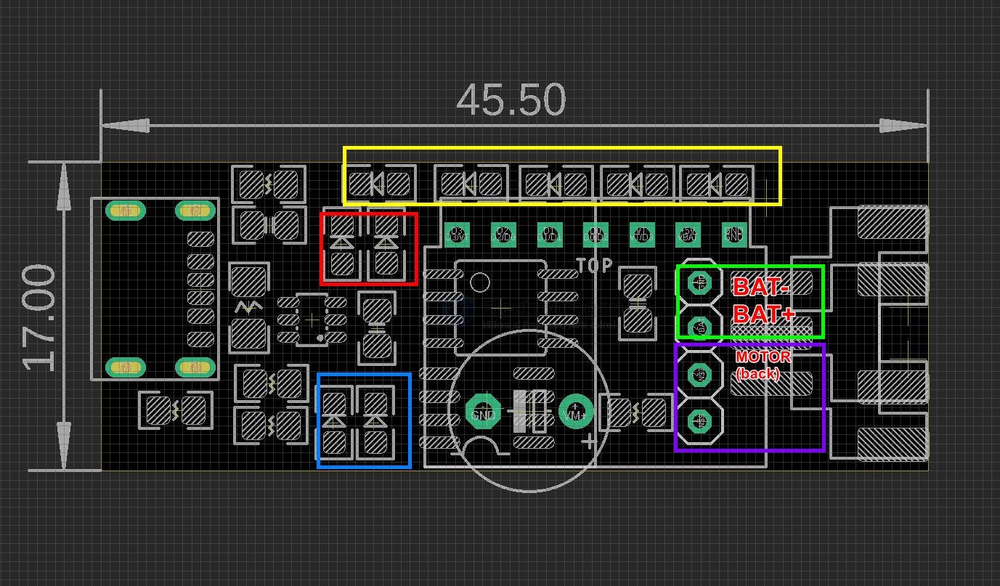

# SDR1120-dat

## Info

product url - 

### Board Map, Dimension, Pins, chip info, Use Guide, Setup Jumper, etc.

wireless motor drive board 

- [[L9110-dat]] 

- [[attiny13-dat]] - [[MCU-dat]] - [[STC-dat]] == STC8G1K17A-36I-DIP8

- [[EDRF1-dat]] == [[NWL1089-dat]] - [[RF-LINK-dat]]

- [[motor-driver-dat]] - [[motor-dat]]

- 4x RF button pressed LED 
- 1x RF button VT LED
- 1x programmer LED from [[attiny13-dat]] pin 1 
- 1x power indicator LED 
- 2x battery charge indicator LED - [[TP4067-dat]]

- Front side socket (with USB) == battery side 
- Back side socket == motor side

## drive chip 

- [[STC-SOP8-dat]] - [[DIP8-dat]]

| pin | func | note                     | app     |
| --- | ---- | ------------------------ | ------- |
| 2   | VCC  | power                    |         |
| 4   | GND  | power                    |         |
| 1   | P5.4 | general purpose I/O      | LED     |
| 3   | P5.5 | general purpose I/O      | D2      |
| 5   | P3.0 | RXD, general purpose I/O | D1      |
| 6   | P3.1 | TXD, general purpose I/O | D0      |
| 7   | P3.2 | general purpose I/O      | MOTOR_B |
| 8   | P3.3 | general purpose I/O      | MOTOR_A |

## Applications, category, tags, etc. 

## Demo Code and Video

#stc #rf tt motor control == https://t.me/electrodragon3/453

demo code at - [[STC-SDK-dat]] repro

## ref 

- [[SDR1120]] 

- legacy wiki page 
