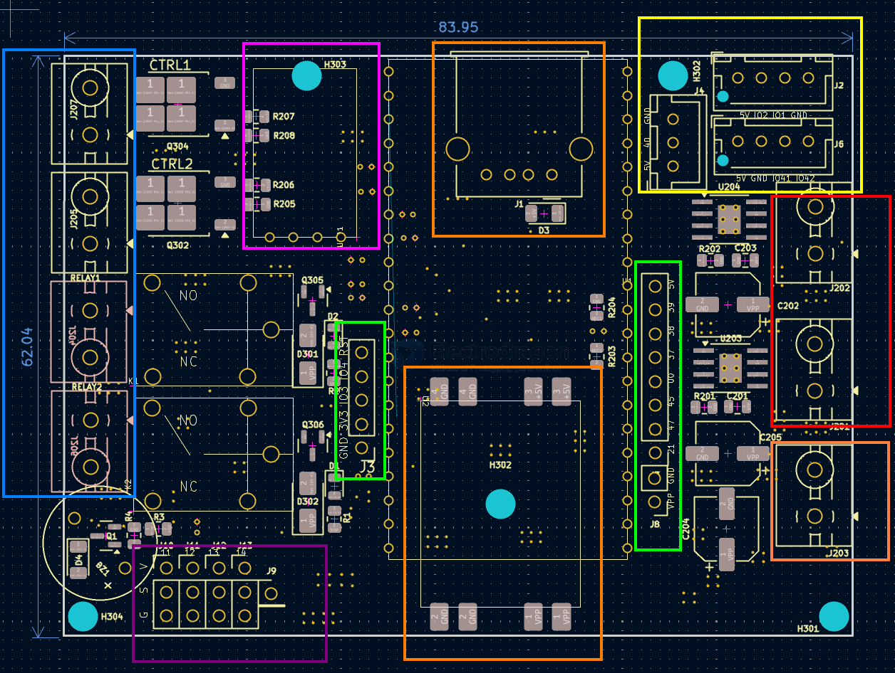

# SDR1125-dat.md

- [[SDR1125-dat]] - [[CRSF-dat]]

orange boxes series 

- [[OPM1153-dat]] - [[MP1584-dat]] == orange middle module 

- [[CONN-USB-A-dat]] USB output 5V 

- orange right-bottom == power input - [[dcdc-down-dat]]

red box

- [[DRV8871-dat]] == 2x motor driver - [[motor-driver-dat]] - [[motor-dat]]
  - motor1 IO15 IO18
  - motor2 IO7 IO8 

yellow boxes
- 5V IO40 GND 
- 5V IO2 IO1 GND 
- 5V GND IO41 IO42 
- support - [[location-dat]] input 

main controller
- [[ESP32-S3-dat]]

green box 
- extra lead-out pins 
  - RST, IO4, IO3, 3V3, GND
  - 5V, IO39, IO38, IO37, IO0, IO45, IO47, IO21, GND, VIN

- BAT monitor == IO36 - [[ADC-dat]]

blue box 
- 2x mosfet == IO 5 6  - [[mosfet-dat]]
- 2x relay == IO 9 10  - [[relay-dat]]

- 4x servos == IO11 12 13 14 - [[motor-servo-dat]]

purple box 

- [[ELRS-dat]] - IO 16 17 

## ref 

