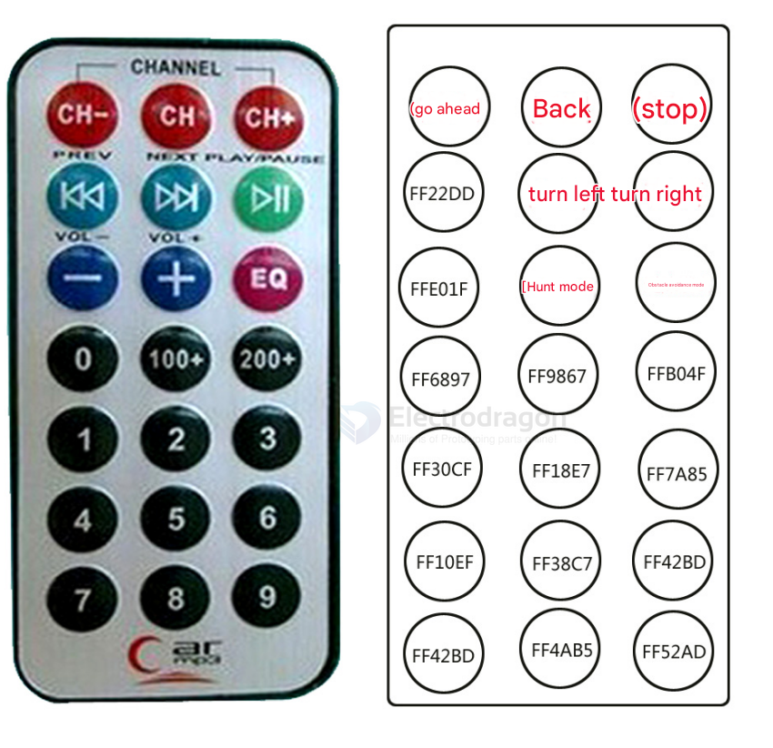

# SIR1003-dat

- [[infrared-sender-dat]]

[Infrared Dev Kit: Controller(NEC Type) and HX1838 Receiver](https://www.electrodragon.com/product/infrared-dev-kit-controllernec-type-and-hx1838-receiver/)

## board map 

## receiver 

- Remote control range: 8-10 meters (the quality of the infrared receiver itself, whether there are obstacles in the middle, etc. will affect the remote control distance)
- Battery: 3V button lithium manganese battery
- Infrared carrier frequency: 38KHz
- Surface material: 0.125mmPET
- Effective life: more than 20,000 times

## ref 

- [[Infrared-dat]]

- [[SIR1003]]