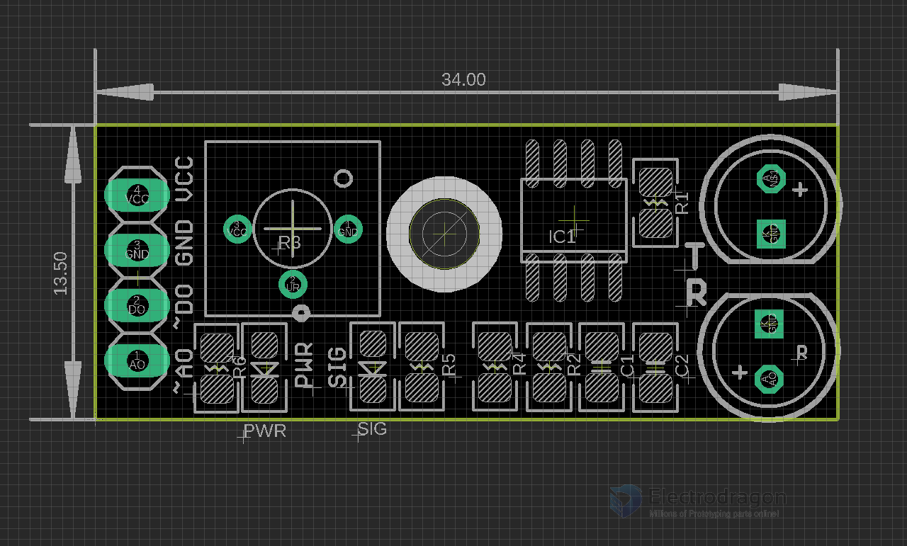

# SMO1003-dat

## Interface(3-wire)

- VCC external 3.3V-5V voltage (can be directly connected with the a 5v microcontroller and 3.3v microcontroller)
- GND external GND
- OUT board digital output interface (0 and 1)

## ref 

- [[SMO1003]]