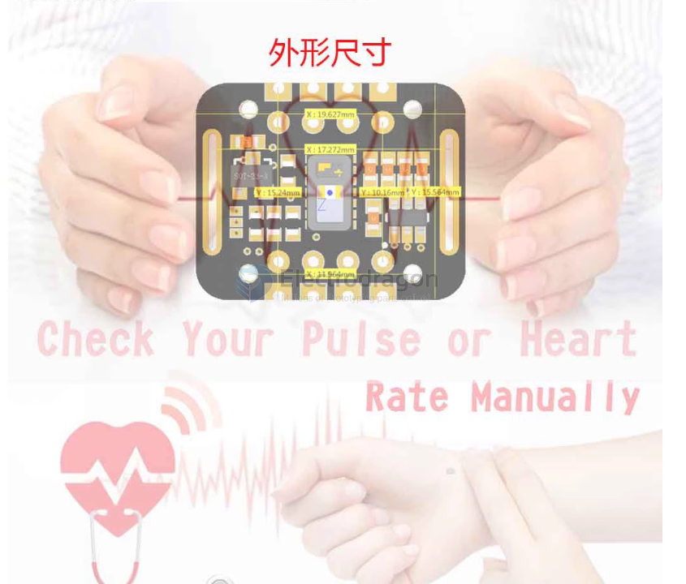

# SMO1013-dat

- [[MAX30102-dat]]

https://www.electrodragon.com/product/max30102-pulse-oximeter-heart-rate-sensor-module/

- Black version MAX30102
- VIN (input voltage): 1.8V-5.0V
- Logic voltage: Default pull-up voltage is 3.3V, short-circuiting on board can switch to 1.8V

## demo code 

- visit here - https://github.com/Edragon/Sensor

## ref 

- [[SMO1013]]